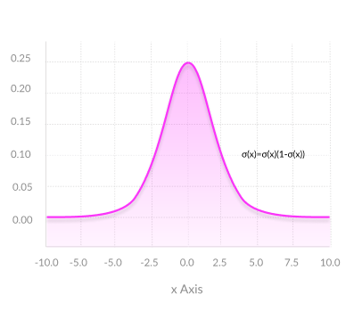

# Activation Functions - Neural Networks:

> Understand the evolution of different types of activation functions in neural network and learn the pros and cons of linear, step, ReLU, PRLeLU, Softmax and Swish.

Neural Network Concepts
-----------------------

Neural network activation functions are a crucial component of deep learning. Activation functions determine the output of a deep learning model, its accuracy, and also the computational efficiency of training a model—which can make or break a large scale neural network. Activation functions also have a major effect on the neural network’s ability to converge and the convergence speed, or in some cases, activation functions might prevent neural networks from converging in the first place.

Contents
------------------------------

* [What is a Neural Network Activation Function?](#section1)
* [The role of activation functions in a Neural Network Model](#section2)
* [Three types of activation functions -- binary step, linear and non-linear, and the importance of non-linear functions in complex deep learning models](#section3)
* [Seven common nonlinear activation functions and how to choose an activation function for your model—sigmoid, TanH, ReLU and more](#section4)
* [Derivatives or gradients of common activation functions](#section5)
* [How neural network activation functions are used in real world projects](#section6)

What is a Neural Network Activation Function?
---------------------------------------------

Activation functions are mathematical equations that determine the output of a neural network. The function is attached to each neuron in the network, and determines whether it should be activated (“fired”) or not, based on whether each neuron’s input is relevant for the model’s prediction. Activation functions also help normalize the output of each neuron to a range between 1 and 0 or between -1 and 1.

An additional aspect of activation functions is that they must be computationally efficient because they are calculated across thousands or even millions of neurons for each data sample. Modern neural networks use a technique called backpropagation to train the model, which places an increased computational strain on the activation function, and its derivative function.

The need for speed has led to the development of new functions such as ReLu and Swish (see more about [nonlinear activation functions](#commonnonlinear) below).

### What are Artificial Neural Networks and Deep Neural Networks?

[Artificial Neural Networks](https://missinglink.ai/guides/neural-network-concepts/complete-guide-artificial-neural-networks/) (ANN) are comprised of a large number of simple elements, called neurons, each of which makes simple decisions. Together, the neurons can provide accurate answers to some complex problems, such as natural language processing, computer vision, and AI.

A neural network can be “shallow”, meaning it has an input layer of neurons, only one “hidden layer” that processes the inputs, and an output layer that provides the final output of the model. A Deep Neural Network (DNN) commonly has between 2-8 additional layers of neurons. Research from [Goodfellow, Bengio and Courville](http://www.deeplearningbook.org/) and other experts suggests that neural networks increase in accuracy with the number of hidden layers.

### "Non-deep" feedforward neural network

### Deep neural network

Role of the Activation Function in a Neural Network Model
---------------------------------------------------------

In a neural network, numeric data points, called inputs, are fed into the neurons in the input layer. Each neuron has a weight, and multiplying the input number with the weight gives the output of the neuron, which is transferred to the next layer.

The activation function is a mathematical “gate” in between the input feeding the current neuron and its output going to the next layer. It can be as simple as a step function that turns the neuron output on and off, depending on a rule or threshold. Or it can be a transformation that maps the input signals into output signals that are needed for the neural network to function.

Increasingly, neural networks use non-linear activation functions, which can help the network learn complex data, compute and learn almost any function representing a question, and provide accurate predictions.

**The basic process carried out by a neuron in a neural network is:**

 \* This is just the number 1, making it possible to represent activation functions that do not cross the origin. [Biases](https://missinglink.ai/guides/neural-network-concepts/neural-network-bias-bias-neuron-overfitting-underfitting/) are also assigned a weight.

3 Types of Activation Functions
-------------------------------

### Binary Step Function

A binary step function is a threshold-based activation function. If the input value is above or below a certain threshold, the neuron is activated and sends exactly the same signal to the next layer.

The problem with a step function is that it does not allow multi-value outputs—for example, it cannot support classifying the inputs into one of several categories.

### Linear Activation Function

A linear activation function takes the form:

**A = cx**

It takes the inputs, multiplied by the weights for each neuron, and creates an output signal proportional to the input. In one sense, a linear function is better than a step function because it allows multiple outputs, not just yes and no.

However, a linear activation function has two major problems:

**1\. Not possible to use [backpropagation](https://missinglink.ai/guides/neural-network-concepts/backpropagation-neural-networks-process-examples-code-minus-math/)**  (gradient descent) to train the model—the derivative of the function is a constant, and has no relation to the input, X. So it’s not possible to go back and understand which weights in the input neurons can provide a better prediction.

[**_Go in-depth: See our guide on backpropagation_**](https://missinglink.ai/guides/neural-network-concepts/backpropagation-neural-networks-process-examples-code-minus-math/) 

**2\. All layers of the neural network collapse into one**—with linear activation functions, no matter how many layers in the neural network, the last layer will be a linear function of the first layer (because a linear combination of linear functions is still a linear function). So a linear activation function turns the neural network into just one layer.

A neural network with a linear activation function is simply a linear regression model. It has limited power and ability to handle complexity varying parameters of input data.

### Non-Linear Activation Functions

Modern neural network models use non-linear activation functions. They allow the model to create complex mappings between the network’s inputs and outputs, which are essential for learning and modeling complex data, such as images, video, audio, and data sets which are non-linear or have high dimensionality.

Almost any process imaginable can be represented as a functional computation in a neural network, provided that the activation function is non-linear.

Non-linear functions address the problems of a linear activation function:

1. They allow backpropagation because they have a derivative function which is related to the inputs.
2. They allow “stacking” of multiple layers of neurons to create a deep neural network. Multiple hidden layers of neurons are needed to learn complex data sets with high levels of accuracy.

7 Common Nonlinear Activation Functions  and How to Choose an Activation Function
---------------------------------------------------------------------------------

### Sigmoid / Logistic

###### Advantages

* **Smooth gradient**, preventing “jumps” in output values.
* **Output values bound** between 0 and 1, normalizing the output of each neuron.
* **Clear predictions**—For X above 2 or below -2, tends to bring the Y value (the prediction) to the edge of the curve, very close to 1 or 0. This enables clear predictions.

###### Disadvantages

* **Vanishing gradient**—for very high or very low values of X, there is almost no change to the prediction, causing a vanishing gradient problem. This can result in the network refusing to learn further, or being too slow to reach an accurate prediction.
* **Outputs not zero centered**.
* **Computationally expensive**

### TanH / Hyperbolic Tangent

###### Advantages

* **Zero centered**—making it easier to model inputs that have strongly negative, neutral, and strongly positive values.
* Otherwise like the Sigmoid function.

###### Disadvantages

* Like the Sigmoid function

### ReLU (Rectified Linear Unit)

###### Advantages

* **Computationally efficient**—allows the network to converge very quickly
* **Non-linear—**although it looks like a linear function, ReLU has a derivative function and allows for backpropagation

###### Disadvantages

* **The Dying ReLU problem**—when inputs approach zero, or are negative, the gradient of the function becomes zero, the network cannot perform backpropagation and cannot learn.

### Leaky ReLU

###### Advantages

* **Prevents dying ReLU problem**—this variation of ReLU has a small positive slope in the negative area, so it does enable backpropagation, even for negative input values
* Otherwise like ReLU

###### Disadvantages

* **Results not consistent**—leaky ReLU does not provide consistent predictions for negative input values.

### Parametric ReLU

###### Advantages

* **Allows the negative slope to be learned**—unlike leaky ReLU, this function provides the slope of the negative part of the function as an argument. It is, therefore, possible to perform backpropagation and learn the most appropriate value of α.
* Otherwise like ReLU

###### Disadvantages

* **May perform differently** for different problems.

### Softmax

###### Advantages

* **Able to handle multiple classes** only one class in other activation functions—normalizes the outputs for each class between 0 and 1, and divides by their sum, giving the probability of the input value being in a specific class.
* **Useful for output neurons**—typically Softmax is used only for the output layer, for neural networks that need to classify inputs into multiple categories.

### Swish

Swish is a new, self-gated activation function discovered by researchers at Google. According to their [paper](https://arxiv.org/abs/1710.05941v1), it performs better than ReLU with a similar level of computational efficiency. In experiments on ImageNet with identical models running ReLU and Swish, the new function achieved top -1 classification accuracy 0.6-0.9% higher.

Derivatives or Gradients of Activation Functions
------------------------------------------------

The derivative—also known as a gradient—of an activation function is extremely important for training the neural network.

Neural networks are trained using a process called backpropagation—this is an algorithm which traces back from the output of the model, through the different neurons which were involved in generating that output, back to the original weight applied to each neuron. Backpropagation suggests an optimal weight for each neuron which results in the most accurate prediction.

[**_Go in-depth: See our guide on backpropagation_**](https://missinglink.ai/guides/neural-network-concepts/backpropagation-neural-networks-process-examples-code-minus-math/)

Below are the derivatives for the most common activation functions.

### Sigmoid

### TanH

### ReLU

[Recent research](https://arxiv.org/pdf/1801.09403.pdf) by Franco Manessi and Alessandro Rozza attempted to find ways to automatically learn which is the optimal activation function for a certain neural network and to even automatically combine activation functions to achieve the highest accuracy. This is a very promising field of research because it attempts to discover an optimal activation function configuration automatically, whereas today, this parameter is manually tuned.

Neural Network Activation Functions in the Real World
-----------------------------------------------------

When building a model and training a neural network, the selection of activation functions is critical. Experimenting with different activation functions for different problems will allow you to achieve much better results.

In a real-world neural network project, you will switch between activation functions using the deep learning framework of your choice.

For example, here is how to use the ReLU activation function via the Keras library (see all [supported activations](https://keras.io/activations/)):

`keras.activations.relu(x, alpha=0.0, max_value=None)`

While selecting and switching activation functions in deep learning frameworks is easy, you will find that managing multiple experiments and trying different activation functions on large test data sets can be challenging.

____

@MissingLink.ai 