# Artificial Neural Network Concepts & Models

### @MissingLinkAI

> Learn fundamental concepts of neural networks - backpropagation, activation functions, hyperparameters, RNN, CNN and more.

Neural Network Concepts
-----------------------

If you’re getting started with artificial neural networks (ANN) or looking to expand your knowledge to new areas of the field, this page will give you a brief introduction to all the important concepts of ANN, and explain how to use deep learning frameworks like TensorFlow and PyTorch to build deep learning architecture. Finally, we will also show how [deep learning platforms](https://missinglink.ai/) like MissingLink allow you to scale and manage thousands of deep learning experiments on and off the cloud.

In this article you will learn
------------------------------

* [Neural network basics—neurons or perceptrons, layers, weights and activations](#section1)
* [Perceptrons and multilayer perceptrons—the fundamental unit of the neural network](#section2)
* [Backpropagation—how the neural network trains and finds optimal neuron weights](#section3)
* [Activation functions—the impact of using different functions to process neuron inputs](#section4)
* [Bias—understanding the bias neuron, the concepts of bias vs. variance, and how to prevent overfitting and underfitting](#section5)
* [Hyperparameters—what they are and how to optimize them to improve network performance](#section6)
* [Classification—neural networks vs. traditional classification algorithms](#section7)
* [Regression—neural networks vs. traditional regression models](#section8)
* [Neural network architectures—summary of the major advanced neural network architectures, including CNN, RNN, CAPSNet and GAN](#section9)

What are Artificial Neural Networks and Deep Neural Networks?
-------------------------------------------------------------

Artificial Neural Networks (ANN) is a supervised learning system built of a large number of simple elements, called neurons or perceptrons. Each neuron can make simple decisions, and feeds those decisions to other neurons, organized in interconnected layers. Together, the neural network can emulate almost any function, and answer practically any question, given enough training samples and computing power. A “shallow” neural network has only three layers of neurons:

* **An input layer** that accepts the independent variables or inputs of the model
* **One hidden layer**
* **An output layer** that generates predictions

A Deep Neural Network (DNN) has a similar structure, but it has two or more “hidden layers” of neurons that process inputs. [Goodfellow, Bengio and Courville](http://www.deeplearningbook.org/) showed that while shallow neural networks are able to tackle complex problems, deep learning networks are more accurate, and improve in accuracy as more neuron layers are added. Additional layers are useful up to a limit of 9-10, after which their predictive power starts to decline. Today most neural network models and implementations use a deep network of between 3-10 neuron layers. 

Artificial Neural Network Concepts
----------------------------------

Here is a glossary of basic terms you should be familiar with before learning the details of neural networks.

### Inputs

Source data fed into the neural network, with the goal of making a decision or prediction about the data. Inputs to a neural network are typically a set of real values; each value is fed into one of the neurons in the input layer.

### Training Set

A set of inputs for which the correct outputs are known, used to train the neural network.

### Outputs

Neural networks generate their predictions in the form of a set of real values or boolean decisions. Each output value is generated by one of the neurons in the output layer.

### Neuron/perceptron

The basic unit of the neural network. Accepts an input and generates a prediction.

Each neuron accepts part of the input and passes it through the activation function. Common activation functions are sigmoid, TanH and ReLu. Activation functions help generate output values within an acceptable range, and their non-linear form is crucial for [training the network](https://missinglink.ai/guides/deep-learning-healthcare/tensorflow-resnet-building-training-scaling-residual-networks-tensorflow/).

### Weight Space

Each neuron is given a numeric weight. The weights, together with the activation function, define each neuron’s output. Neural networks are trained by fine-tuning weights, to discover the optimal set of weights that generates the most accurate prediction.

### Forward Pass

The forward pass takes the inputs, passes them through the network and allows each neuron to react to a fraction of the input. Neurons generate their outputs and pass them on to the next layer, until eventually the network generates an output.

### Error Function

Defines how far the actual output of the current model is from the correct output. When training the model, the objective is to minimize the error function and bring output as close as possible to the correct value.

### Backpropagation

In order to discover the optimal weights for the neurons, we perform a backward pass, moving back from the network’s prediction to the neurons that generated that prediction. This is called backpropagation.   Backpropagation tracks the derivatives of the activation functions in each successive neuron, to find weights that brings the loss function to a minimum, which will generate the best prediction. This is a mathematical process called _gradient descent_.

### Bias and Variance

When training neural networks, like in other machine learning techniques, we try to balance between bias and variance. Bias measures how well the model fits the training set—able to correctly predict the known outputs of the training examples. Variance measures how well the model works with unknown inputs that were not available during training. Another meaning of bias is a “[bias neuron](https://missinglink.ai/guides/neural-network-concepts/neural-network-bias-bias-neuron-overfitting-underfitting/)” which is used in every layer of the neural network. The bias neuron holds the number 1, and makes it possible to move the activation function up, down, left and right on the number graph.

### Hyperparameters

A hyperparameter is a setting that affects the structure or operation of the neural network. In real deep learning projects, tuning hyperparameters is the primary way to build a network that provides accurate predictions for a certain problem. Common hyperparameters include the number of hidden layers, the activation function, and how many times (epochs) training should be repeated.

Perceptron and Multilayer Perceptron—the Foundation of Neural Networks
----------------------------------------------------------------------

### What is a Perceptron?

A perceptron is a binary classification algorithm modeled after the functioning of the human brain—it was intended to emulate the neuron. The perceptron, while it has a simple structure, has the ability to learn and solve very complex problems. 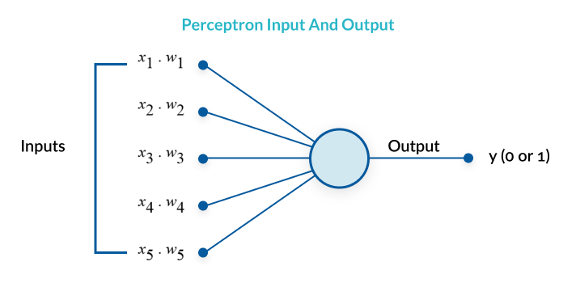

### What is Multilayer Perceptron?

A multilayer perceptron (MLP) is a group of perceptrons, organized in multiple layers, that can accurately answer complex questions. Each perceptron in the first layer (on the left) sends signals to all the perceptrons in the second layer, and so on. An MLP contains an input layer, at least one hidden layer, and an output layer. 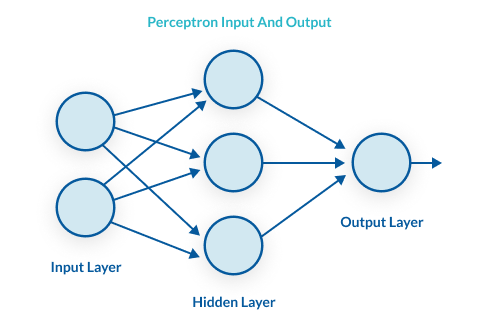

### The Perceptron Learning Process

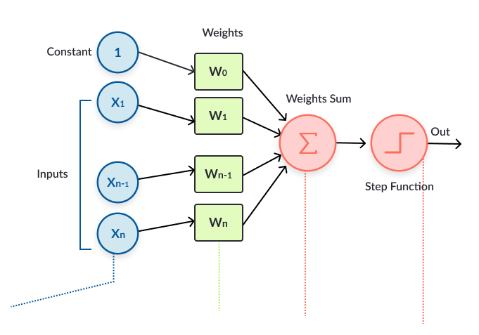 **The perceptron learns as follows:**

1. Takes the inputs which are fed into the perceptrons in the input layer, multiplies them by their weights, and computes the sum.
2. Adds the number one, multiplied by a “bias weight”. This is a technical step that makes it possible to move the output function of each perceptron (the activation function) up, down, left and right on the number graph.
3. Feeds the sum through the activation function—in a simple perceptron system, the activation function is a step function.
4. The result of the step function is the output.

### From Perceptron to Deep Neural Network

A multilayer perceptron is quite similar to a modern neural network. By adding a few ingredients, the perceptron architecture becomes a full-fledged deep learning system:

* [**Activation functions**](#activation) **and other [hyperparameters](#hyperparams)** —a full neural network uses a variety of activation functions which output real values, not boolean values like in the classic perceptron. It is more flexible in terms of other details of the learning process, such as the number of training iterations (iterations and epochs), weight initialization schemes, regularization, and so on. All these can be tuned as hyperparameters.
* [**Backpropagation**](#backprop)—a full neural network uses the backpropagation algorithm, to perform iterative backward passes which try to find the optimal values of perceptron weights, to generate the most accurate prediction.
* [**Advanced architecture****s**](#architectures)—full neural networks can have a variety of architectures that can help solve specific problems. A few examples are [Recurrent Neural Networks (RNN)](#RNN), [Convolutional Neural Networks (CNN)](#CNN), and [Generative Adversarial Networks (GAN)](#GAN).

[**_Go in-depth:_** _See our complete guide to perceptrons and multi-layer perceptrons_](https://missinglink.ai/guides/neural-network-concepts/perceptrons-and-multi-layer-perceptrons-the-artificial-neuron-at-the-core-of-deep-learning/)

Understanding Backpropagation in Neural Networks
------------------------------------------------

### What is Backpropagation and Why is it Important?

After a neural network is defined with initial weights, and a forward pass is performed to generate the initial prediction, there is an error function which defines how far away the model is from the true prediction. There are many possible algorithms that can minimize the error function—for example, one could do a brute force search to find the weights that generate the smallest error. However, for large neural networks, a training algorithm is needed that is very computationally efficient. Backpropagation is that algorithm—it can discover the optimal weights relatively quickly, even for a network with millions of weights.

### How Backpropagation Works

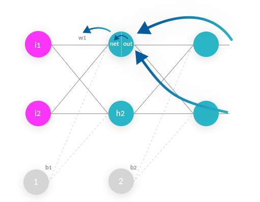

1. **Forward pass**—weights are initialized and inputs from the training set are fed into the network. The forward pass is carried out and the model generates its initial prediction.
2. **Error function**—the error function is computed by checking how far away the prediction is from the known true value.
3. **Backpropagation with gradient descent**—the backpropagation algorithm calculates how much the output values are affected by each of the weights in the model. To do this, it calculates partial derivatives, going back from the error function to a specific neuron and its weight. This provides complete traceability from total errors, back to a specific weight which contributed to that error. The result of backpropagation is a set of weights that minimize the error function.
4. **Weight update**—weights can be updated after every sample in the training set, but this is usually not practical. Typically, a batch of samples is run in one big forward pass, and then backpropagation performed on the aggregate result. The _batch size_ and number of batches used in training, called _iterations_, are important [hyperparameters](#hyperparams) that are tuned to get the best results. Running the entire training set through the backpropagation process is called an _epoch_.

### Backpropagation in the Real World

In the real world, you will probably not code an implementation of backpropagation, because others have already done this for you. You can work with deep learning frameworks like [Tensorflow](https://www.tensorflow.org/) or [Keras](https://keras.io/), which contain efficient implementations of backpropagation, which you can run with only a few lines of code. [**_Go in-depth:_** _Learn more in our complete guide to backpropagation_](https://missinglink.ai/guides/neural-network-concepts/backpropagation-neural-networks-process-examples-code-minus-math/)

Understanding Neural Network Activation Functions
-------------------------------------------------

Activation functions are central to deep learning architectures. They determine the output of the model, its computational efficiency, and its ability to train and converge after multiple iterations of training.

### What is a Neural Network Activation Function?

An activation function is a mathematical equation that determines the output of each element (perceptron or neuron) in the neural network. It takes in the input from each neuron and transforms it into an output, usually between one and zero or between -1 and one. Classic activation functions used in neural networks include the step function (which has a binary input), sigmoid and tanh. New activation functions, intended to improve computational efficiency, include ReLu and Swish. 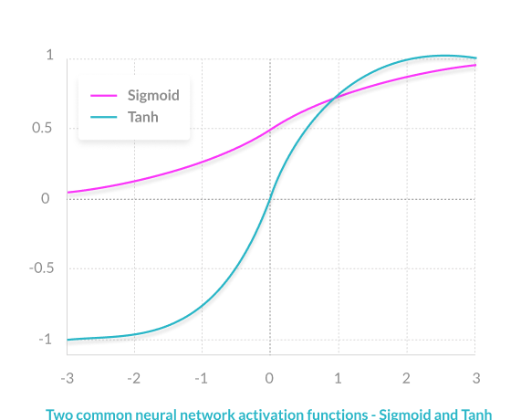

### Role of the Activation Function

In a neural network, inputs, which are typically real values, are fed into the neurons in the network. Each neuron has a weight, and the inputs are multiplied by the weight and fed into the activation function. 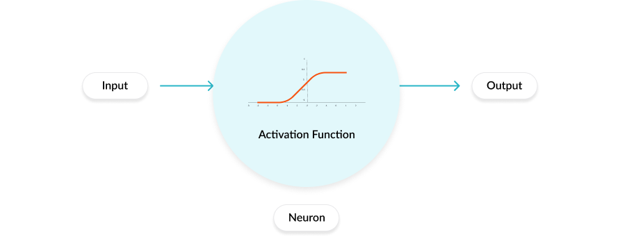 Each neuron’s output is the input of the neurons in the next layer of the network, and so the inputs cascade through multiple activation functions until eventually, the output layer generates a prediction. Neural networks rely on nonlinear activation functions—the derivative of the activation function helps the network learn through the backpropagation process (see [backpropagation](#backprop) above).

### 7 Common Activation Functions

1. **The sigmoid function** has a smooth gradient and outputs values between zero and one. For very high or low values of the input parameters, the network can be very slow to reach a prediction, called the _vanishing gradient_ problem.
2. **The TanH function** is zero-centered making it easier to model inputs that are strongly negative strongly positive or neutral.
3. **The ReLu function** is highly computationally efficient but is not able to process inputs that approach zero or negative.
4. **The Leaky ReLu** function has a small positive slope in its negative area, enabling it to process zero or negative values.
5. **The Parametric ReLu** function allows the negative slope to be learned, performing backpropagation to learn the most effective slope for zero and negative input values.
6. **Softmax** is a special activation function use for output neurons. It normalizes outputs for each class between 0 and 1, and returns the probability that the input belongs to a specific class.
7. **Swish** is a new activation function discovered by Google researchers. It performs better than ReLu with a similar level of computational efficiency.

### Activation Functions in the Real World

The selection of an activation function is critical to building and training in your network. Experimenting with different activation functions will allow you to achieve better results. In real-world neural network projects, the activation function is a [hyperparameter](#hyperparams). You can use the deep learning framework of your choice to change the activation function as you fine-tune your experiments. [**_Go in-depth:_** _Learn more in our complete guide to neural network activation functions_](https://missinglink.ai/guides/neural-network-concepts/7-types-neural-network-activation-functions-right/)

Neural Network Bias
-------------------

In artificial neural networks, the word bias has two meanings:

* It can mean a _bias neuron_, which is part of the structure of the neural network
* It can mean _bias_ as a statistical concept, which reflects how well the network is able to generate predictions based on the training samples you provide.

**The bias neuron** In each layer of the neural network, a bias neuron is added, which simply stores a value of 1. The bias neuron makes it possible to move the activation function left, right, up, or down on the number graph. Without a bias neuron, each neuron takes the input and multiplies it by its weight, without adding anything to the activation equation. This means, for example, it is not possible to input a value of zero and generate an output of two. In many cases it’s necessary to move the entire activation function to the left or to the right, upwards or downwards, to generate the required output values; the bias neuron makes this possible. 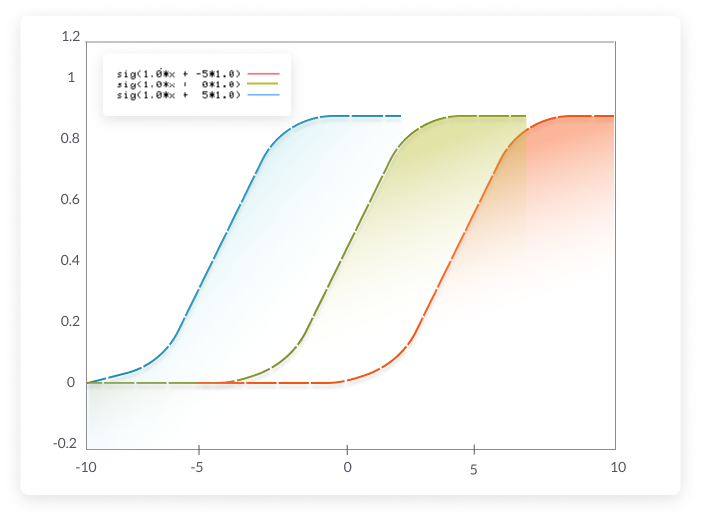

### Definition of Bias vs. Variance in Neural Networks

To understand bias vs. variance, we first need to introduce the concept of a training set and validation set:

* A **training set** is a group of examples which is fed to the neural network during training.
* A **validation set** is a group of unseen examples which you use to test your neural network to see how it performs.
* An **error function** calculates the error, for either the training or validation sets. The eror reflects how far away the network’s actual predictions were compared to the known correct outputs.

**Bias** reflects how well the model fits the training set. A high bias means the neural network is not able to generate correct predictions even for the examples it trained on. **Variance** reflects how well the model fits unseen examples in the validation set.  A high variance means the neural network is not able to correctly predict for new examples it hasn’t seen before. 

### Overfitting and Underfitting in Neural Networks

**Overfitting** happens when the neural network is good at learning its training set, but is not able to generalize its predictions to additional, unseen examples. This is characterized by low bias and high variance. **Underfitting** happens when the neural network is not able to accurately predict for the training set, not to mention for the validation set. This is characterized by high bias and high variance.

### Methods to Avoid Overfitting

Here are a few common methods to avoid overfitting in neural networks:

* **Retraining neural networks**—running the same model on the same training set but with different initial weights, and selecting the network with the best performance.
* **Multiple neural networks**—training several neural network models in parallel, with the same structure but different weights, and averaging their outputs.
* **Early stopping**—training the network, monitoring the error on the validation set after each iteration, and stopping training when the network starts to overfit the data.
* **Regularization**—adding a term to the error function equation, intended to decrease the weights and biases, smooth outputs and make the network less likely to overfit.
* **Tuning performance ratio**—similar to regularization, but using a parameter that defines by how much the network should be regularized.

### Methods to Avoid Underfitting

Here are a few common methods to avoid underfitting in a neural network:

* **Adding neuron layers or inputs**—adding neuron layers, or increasing the number of inputs and neurons in each layer, can generate more complex predictions and improve the fit of the model.
* **Adding more training samples or improving quality**—the more training samples you feed into the network, and the better they represent the variance in the real population, the better the network will perform.
* **Dropout**—randomly “kill” a certain percentage of neurons in every training iteration. This ensures some information learned is randomly removed, reducing the risk of overfitting.
* **Decreasing regularization parameter**—regularization can be overdone. By using a regularization performance parameter, you can learn the optimal degree of regularization, which can help the model better fit the data.

[**_Go in-depth:_** _Learn more in our complete guide to neural network bias_](https://missinglink.ai/guides/neural-network-concepts/neural-network-bias-bias-neuron-overfitting-underfitting/)

Neural Network Hyperparameters
------------------------------

Hyperparameters determine how the neural network is structured, how it trains, and how its different elements function. Optimizing hyperparameters is an art: there are several ways, ranging from manual trial and error to sophisticated algorithmic methods.

### The Difference Between Model Parameter and Hyperparameter

* **A model parameter** is internal to learn your network and is used to make predictions in a production deep learning model. The objective of training is to learn the values of the model parameters.
* **A** **hyperparameter** is an external parameter set by the operator of the neural network. For example, the number of iterations of training, the number of hidden layers, or the activation function. Different values of hyperparameters can have a major impact on the performance of the network.

List of Common Hyperparameters
------------------------------

<table><tbody><tr><td><h6><strong>Hyperparameters related to neural network structure</strong></h6></td><td><h6><strong>Hyperparameters related to the training algorithm</strong></h6></td></tr><tr><td><ul><li>Number of hidden layers</li><li>Dropout</li><li>Activation function</li><li>Weights initialization</li></ul></td><td><ul><li>Learning rate</li><li>Epoch, iterations and batch size</li><li>Optimizer algorithm</li><li>Momentum</li></ul></td></tr></tbody></table>

### 4 Methods of Hyperparameter Tuning

In a neural network experiment, you will typically try many possible values of hyperparameters and see what works best. In order to evaluate the success of different values, retrain the network, using each set of hyperparameters, and test it against your validation set. If your training set is small, you can use **cross-validation**—dividing the training set into multiple groups, training the model on each of the groups then validating it on the other groups. Following are common methods used to tune hyperparameters:

1. **Manual hyperparameter tuning**—an experienced operator can guess parameter values that will achieve very high accuracy. This requires trial and error.
2. **Grid search**—this involves systematically testing multiple values of each hyperparameter and retraining the model for each combination.
3. **Random search**—a research study by [Bergstra and Bengio](http://www.jmlr.org/papers/volume13/bergstra12a/bergstra12a.pdf) showed that using random hyperparameter values is actually more effective than manual search or grid search.
4. **Bayesian optimization—**a method proposed by [Shahriari, et al](https://drive.google.com/viewerng/viewer?url=https://www.cs.ox.ac.uk/people/nando.defreitas/publications/BayesOptLoop.pdf), which trains the model with different hyperparameter values over and over again, and tries to observe the shape of the function generated by different parameter values. It then extends this function to predict the best possible values. This method provides higher accuracy than random search.

### Hyperparameter Optimization in the Real World

In a real neural network project, you can either manually optimize hyperparameter values; use optimization techniques in the deep learning framework of your choice, or use one of several third-party hyperparameter optimization tools. **If you use** **Keras**, you can use these libraries for hyperparameter optimization: [Hyperopt](https://github.com/maxpumperla/hyperas), [Kopt](https://github.com/Avsecz/kopt) and [Talos](https://github.com/autonomio/talos) **If you use TensorFlow**, you can use [GPflowOpt](https://github.com/GPflow/GPflowOpt) for bayesian optimization, and commercial solutions like Google’s [Cloud Machine Learning Engine](https://cloud.google.com/ml-engine/docs/tensorflow/using-hyperparameter-tuning) which provide multiple optimization options. **For third-party optimization tools**, see this post by [Mikko Kotila](https://medium.com/@mikkokotila/a-comprehensive-list-of-hyperparameter-optimization-tuning-solutions-88e067f19d9). [**_Go in-depth:_** _Learn more in our complete guide to hyperparameters_](https://missinglink.ai/guides/neural-network-concepts/hyperparameters-optimization-methods-and-real-world-model-management/)

Classification with Neural Networks
-----------------------------------

### What is classification in machine and deep learning?

There are numerous, highly effective classification algorithms; neural networks are just one of them. The unique strength of a neural network is its ability to dynamically create complex prediction functions, and solve classification problems in a way that emulates human thinking. For certain classification problems, neural networks can provide improved performance compared to other algorithms. However, because neural networks are more computationally intensive and more complex to set up, they may be overkill in many cases.

### Types of classification algorithms

To understand classification with neural networks let’s cover some other common classification algorithms. Some algorithms are binary, providing a yes/no decision, while others are multi-class, letting you classify an input into several categories.

* **Logistic regression** (binary)—analyzes a set of data points and finds the best fitting model to describe them. Easy to implement and very effective for input variables that are well known, and closely correlated with the outcome.
* **Decision tree** (multiclass)—classifies using a tree structure with if-then rules, running the input through a series of decisions until it reaches a termination condition. Able to model complex decision processes and is highly intuitive, but can easily overfit the data.
* **Random forest** (multiclass)—an ensemble of decision trees, with automatic selection of the best performing tree. Provides the strength of the decision tree algorithm without the problem of overfitting.
* **Naive Bayes classifier** (multiclass)—a probability-based classifier. Calculates the likelihood that each data point exists in each of the target categories. Simple to implement and accurate for a large set of problems, but sensitive to the set of categories selected.
* **k-Nearest neighbor** (multiclass)—classifies each data point by analyzing its nearest neighbors among the training examples. Simple to implement and understand, effective for many problems, especially those with low dimensionality. Provides lower accuracy compared to supervised algorithms, and is computationally intensive.

### Neural Network Classification Compared To Other Classifier Algorithms

Neural networks classify by passing the input values through a series of neuron layers, which perform complex transformations on the data. **Strengths:** Neural networks are very effective for high dimensionality problems, or with complex relations between variables. For example, neural networks can be used to classify and label images, audio, and video, perform sentiment analysis on text, and classify security incidents into risk categories. **Weaknesses:** Neural networks are theoretically complex, difficult to implement, requiring careful fine-tuning, and computationally intensive. Unless you’re a deep learning expert, you will usually derive more value from another classification algorithm if it can provide similar performance.

### Neural Networks and Other Machine Learning Classifiers in the Real World

In a real-world machine learning project, you will probably experiment with several classification algorithms to see which provides the best result. **If you restrict yourself to regular classifiers** (not neural networks), you can use open source libraries like [scikit-learn](http://scikit-learn.org/stable/auto_examples/classification/plot_classifier_comparison.html), which provides ready-made implementations of popular algorithms and is easy to get started with. **If you want to try neural network classification**, you will need to use deep learning frameworks like [TensorFlow](https://www.tensorflow.org/), [Keras](https://keras.io/), and [PyTorch](https://pytorch.org/). These frameworks are very powerful, supporting both neural networks and traditional classifiers like naive bayes, but have a steeper learning curve. [**_Go in-depth:_** _Learn more in our complete guide to classification with neural networks_](https://missinglink.ai/guides/neural-network-concepts/classification-neural-networks-neural-network-right-choice/)

Using Neural Networks for Regression
------------------------------------

### What is Regression Analysis?

For decades, regression models have proven useful in modeling problems and providing predictions. This is the classic linear regression function:  In a regression model, the inputs are called **independent values** (X1..K in the equation above). The output is called the **dependent value** (y in the equation above). There are weights called **coefficients**, which determine how much each input value contributes to the result, or how important it is (β1..K in the equation above). Neural networks are able to model complex problems, using a learning process that emulates the human brain. Can you use a neural network to run a regression? The short answer is yes – neural networks can generate a model that approximates any regression function. Moreover, most regression models do not fit the data perfectly, and neural networks can generate a more complex model that will provide higher accuracy.

### Types of Regression Analysis

* **Linear regression**—suitable for dependent values which can be fitted with a straight line (linear function).
* **Polynomial regression**—suitable for dependent variables which can be fitted by a curve or series of curves.
* **Logistic regression**—suitable for dependent variables which are binary, and therefore not normally distributed.
* **Stepwise regression—**an automated technique that can deal with high dimensionality of independent variables.
* **Ridge regression**—a regression technique that helps with multicollinearity, independent variables that are highly correlated. It adds a bias to the regression estimates, penalizing coefficients using a shrinkage parameter.
* **Lasso regression**—like Ridge regression, shrinks coefficients to solve multicollinearity, however, it also shrinks the absolute values, meaning some of the coefficients can become zero. This performs “feature selection”, removing some variables from the equation.
* **ElasticNet regression**—combines Ridge and Lasso regression, and is trained with L1 and L2 regularization, trading off between the two techniques.

### Regression in Neural Networks

Neural networks are a far more complex mathematical structure than regression models, but they are reducible to regression equations. Essentially, any regression equation can be modeled by a neural network. For example, this very simple neural network, which takes them several inputs, multiplies them by weights, and passes them through a step function, is equivalent to a logistic regression. A slightly more complex neural network can be constructed to model a multi-class regression classification, using the Softmax activation function to generate probabilities for each class, which can be normalized to sum up to 1.

### Should Neural Networks be Used to Run Regression Models?

Neural networks can be used to create regression models. But is it worthwhile to use them for this purpose? The answer depends on your intuition regarding the effectiveness of the regression function:

* For some datasets and problems, regression functions can provide very accurate answers. In these cases, a neural network is probably not needed.
* If the data is complex and the regression function cannot model it accurately, a neural network can create a more complex mathematical structure that will accurately represent the data. In these more complex cases, neural networks can have much more predictive power and can perform much better than a regression function.

### Regression with Neural Networks in Real Life

To run a traditional regression function, you would typically use [R](https://www.r-project.org/) or another mathematics or statistics library. In order to run a neural network equivalent to a regression model, you will need to use deep learning frameworks, such as TensorFlow, Keras or PyTorch, which are more difficult to master. While neural networks have their overhead and are more theoretically complex, they provide prediction power uncomparable to the most sophisticated regression models. Regression equations are limited and cannot perfectly fit all expected data sets, and the more complex your scenario, the more you will benefit from entering the world of deep learning. **_Go in-depth:_** _Learn more in our complete guide to [using neural networks for regression](https://missinglink.ai/guides/neural-network-concepts/neural-networks-regression-part-1-overkill-opportunity/)_

Neural Network Architecture
---------------------------

We covered the traditional or “plain vanilla” Artificial Neural Network architecture in previous sections: [Multilayer Perceptrons](#perceptrons) and [Understanding Backpropagation](#backprop). On top of this basic structure, researchers have proposed several advanced architectures. Below we cover several architectures which are widely deployed and help provide answers to questions that are difficult to solve with a traditional neural network structure.

### Convolutional Neural Networks (CNN)

[Convolutional Neural Networks](https://missinglink.ai/guides/neural-network-concepts/convolutional-neural-network-build-one-keras-pytorch/) (CNN) have proven very effective at tasks involving data that is closely knitted together, primarily in the field of computer vision. A CNN uses a three-dimensional structure, with three sets of neurons analyzing the three layers of a color image—red, green and blue. It analyzes an image one area at a time to identify important features. **CNN Architecture** The “fully connected” neural network structure, in which all neurons in one layer communicate with all the neurons in the next layer, is inefficient when it comes to analyzing large images. A CNN uses a three-dimensional structure in which neurons in one layer do not connect to all the neurons in the next layer, instead, each set of neurons analyzes a small region or “feature” of the image. The final output of this structure is a single vector of probability scores. A CNN first performs a _convolution_, which involves “scanning” the image, analyzing a small part of it each time, and creating a _feature map_ with probabilities that each feature belongs to the required class (in a simple classification example). The second step is _pooling_, which reduces the dimensionality of each feature while maintaining its most important information. 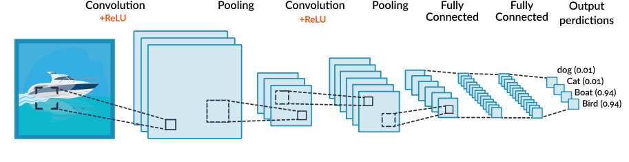 As illustrated above, a CNN can perform several rounds of convolution then pooling. Finally, when the features are at the right level of granularity, it creates a fully-connected neural network that analyzes the final probabilities and decides which class the image belongs to. The final step can also be used for more complex tasks, such as generating a caption for the image. **What can a CNN do? A few example applications:**

* [**Face recognition**](https://missinglink.ai/guides/deep-learning-frameworks/tensorflow-face-recognition-three-quick-tutorials/)
* **Identifying and classifying everyday objects in images**
* **Powering vision in robots and autonomous vehicles**
* **Recognizing scenes and suggest relevant captions**
* **Semantic parsing, sentence classification, and prediction**
* **Search query retrieval**

To learn more about implementing CNNs, see [Convolutional Neural Network: How to Build One in Keras & PyTorch](https://missinglink.ai/guides/neural-network-concepts/convolutional-neural-network-build-one-keras-pytorch/)

### CAPSNet

CAPSNet is a new architecture proposed in 2017, which aims to solve a problem of Convolutional Neural Networks (CNN). CNNs are good at classifying images, but they fail when images are rotated or tilted, or when an image has the features of the desired object, but not in the correct order or position, for example, a face with the nose and mouth switched around. The reason a CNN has trouble classifying these types of images is that it performs multiple phases of convolution and pooling. The pooling step summates and reduces the information in each feature discovered in the image. In this process, it loses important information such as the position of the feature and its relation to other features. For “ordinary” images this works well, but when images are not presented as expected, e.g. tilted sideways, the network will not classify the image into its correct class.

**CAPSNet Architecture**

CAPSNet is based on the concept of neural “capsules”. It starts with the convolution step just like a regular CNN. But instead of the pooling step, when the network discovers features in the image, it reshapes them into vectors, “squashes” them using a special activation function, and feeds each feature into a _capsule_. This is a specialized neural structure that deals only with this feature. Each capsule in the first layer begins processing and then feeds its result to one or more levels of secondary capsules, nested within the first capsule. This is called _routing by agreement_. The primary capsule detects the learned features (e.g. left ear, right ear, nose), preserving contextual information like position and relation to other elements. 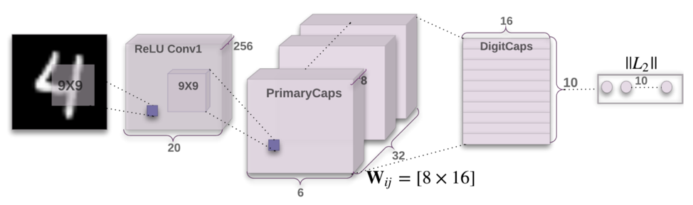 **Encoder Architecture. Image Source: [Dynamic Routing Between Capsules Paper](https://arxiv.org/abs/1710.09829)**

The second part of the CAPSNet structure, called the _decoder_, uses the result of each capsule to recreate the image, based on the learned features. This final image is run through three fully-connected layers to perform the final classification. 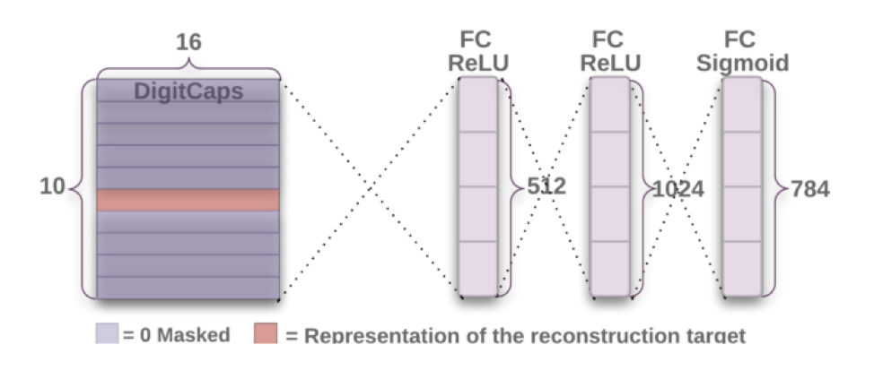 **Decoder Architecture. Image Source: [Dynamic Routing Between Capsules Paper](https://arxiv.org/abs/1710.09829)**

### Recurrent Neural Networks (RNN)

A Recurrent Neural Network (RNN) helps neural networks deal with input data that is sequential in nature. For example, written text, video, audio, or multiple events that occur one after the other, as in networking or security analytics. An RNN network accepts a series of inputs, remembers the previous inputs, and with each new input, adds a new layer of understanding. **RNN Architecture** 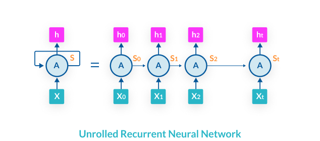

An RNN looks at a series of inputs over time, X0, X1, X2, until Xt. For example, this could be a sequence of frames in a video or words in a sentence. The neural network has one layer of neurons for each input. When the RNN network learns, it performs Backpropagation Through Time (BPTT), a multi-layered form of backpropagation. BPTT uses the chain rule to go back from the latest time step (Xt), progressively to each previous step, each time using gradient descent to discover the best weights for each neuron, and also learn the optimal weights that govern the transfer of information between one time step to the next. **What can an RNN Do?**

* **Language modeling and text generation**—models work by predicting the most suitable next character, next word, or next phrase in a string of text.
* **Machine translation**—text in the source language is input in batch, and the model attempts to generate matching text in the target language.
* **Speech recognition**—the input is acoustic signals parsed from an audio recording; the model outputs the most likely language phonetic element for each part of the recording.
* **Generating image captions**—the input is an image, and the model identifies features in the image and generates text that describes it.
* **Time series anomaly detection**—the input is a sequential data series, such as a series of events in a potential cybersecurity incident. The model predicts if the data is an anomaly compared to normal behavior.
* **Video tagging**—the input is a series of video frames, and the model generates a textual description of each frame of the video.

[**_Go in-depth:_** _Learn more in our complete guide to Recurrent Neural Networks (RNN)_](https://missinglink.ai/guides/neural-network-concepts/recurrent-neural-network-glossary-uses-types-basic-structure/)

### Generative Adversarial Networks (GAN)

Generative Adversarial Networks (GAN) allow neural networks to generate photos, paintings and other artifacts that closely resemble real ones created by humans. It uses two neural networks, one of which generates sample images, and another which learns how to discriminate auto-generated images from real images. The closed feedback loop between the two networks makes them better and better at generating fake artifacts that resemble real ones.

**GAN Architecture**

GAN mimics images by pitting two neural networks against each other, one a convolutional neural network, the “generator”, and the other a deconvolutional neural network, the “discriminator.” The generator starts from random noise and creates new images, passing them to the discriminator, in the hope they will be deemed authentic (even though they are fake). The discriminator aims to identify images coming from the generator as fake, distinguishing them from real images. In the beginning, this is easy, but it becomes harder and harder. The discriminator learns based on the ground truth of the image samples which it knows. The generator learns from the feedback of the discriminator—if the discriminator “catches” a fake image, the generator tries harder to emulate the source images. 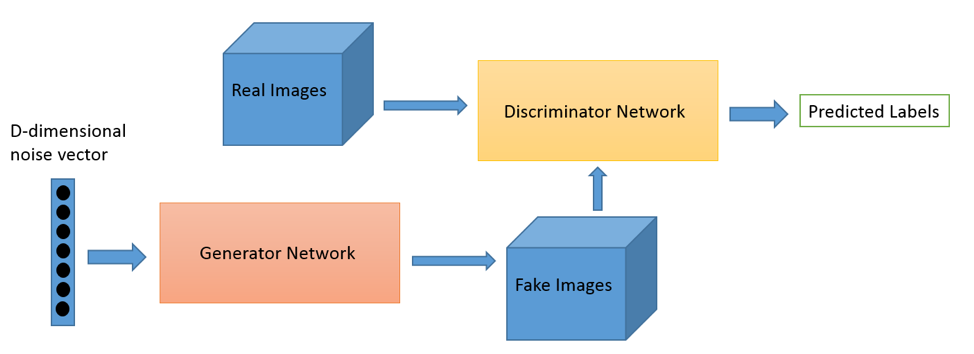 **What can a GAN do?** GANs can automatically generate or enhance:

* Photos
* Paintings
* Prose
* Speech
* Video

Examples of practical implications are generating art very similar to art by famous painters, visualizing how a person might look when they are old, visualizing industrial or interior design models, constructing 3D models from images, and improving quality of low-resolution images.

Artificial Neural Networks in the Real World
--------------------------------------------

In this page, we covered many fundamental concepts of neural networks, including perceptron learning, backpropagation, activation functions, bias and variance, hyperparameters, and basic applications like classification and regression. We also covered several common advanced architectures, built on the basic neural network structure to solve new types of problems.

**_This is just the introduction to a series of in-depth guides about neural network concepts_**

* _To learn about these concepts in more depth, please see links to all our guide pages in the section below__._

Once you understand the mechanics of neural networks, and start working on real-life projects, you will use deep learning frameworks such as Keras, TensorFlow, and PyTorch to create, train and evaluate neural network models. These frameworks do not require an in-depth understanding of the mathematical structure of the models; they will allow you to create very complex neural network structures in only a few lines of code. Your focus will be on collecting high-quality training examples, selecting the best neural network architecture for your problem, and tuning hyperparameters to achieve the best results. 