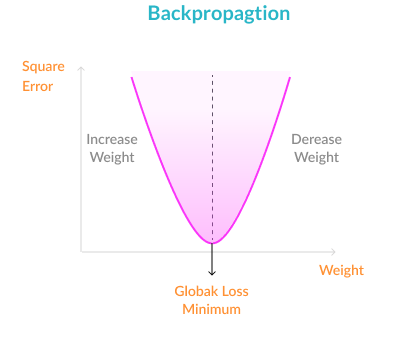
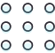

# Backpropagation in Neural Networks:

### @ MissingLink.ai

> Backpropagation is a basic concept in neural networks—learn how it works, with an intuitive backpropagation example from popular deep learning frameworks.

What is backpropagation?
------------------------

Backpropagation is an algorithm commonly used to train neural networks. When the neural network is initialized, weights are set for its individual elements, called neurons. Inputs are loaded, they are passed through the network of neurons, and the network provides an output for each one, given the initial weights. Backpropagation helps to adjust the weights of the neurons so that the result comes closer and closer to the known true result. 

What Are Artificial Neural Networks and Deep Neural Networks?
-------------------------------------------------------------

[Artificial Neural Networks](https://missinglink.ai/guides/neural-network-concepts/complete-guide-artificial-neural-networks/) (ANN) are a mathematical construct that ties together a large number of simple elements, called neurons, each of which can make simple mathematical decisions. Together, the neurons can tackle complex problems and questions, and provide surprisingly accurate answers. A shallow neural network has three layers of neurons that process inputs and generate outputs. A Deep Neural Network (DNN) has two or more “hidden layers” of neurons that process inputs. According to Goodfellow, Bengio and Courville, and other experts, while shallow neural networks can tackle equally complex problems, deep learning networks are more accurate and improve in accuracy as more neuron layers are added. 

ANN and DNN Concepts Relevant to Backpropagation
------------------------------------------------

Here are several neural network concepts that are important to know before learning about backpropagation:

*  
  
  ### Inputs
  
  Source data fed into the neural network, with the goal of making a decision or prediction about the data. The data is broken down into binary signals, to allow it to be processed by single neurons—for example an image is input as individual pixels.

*  
  
  ### Training Set
  
  A set of outputs for which the correct outputs are known, which can be used to train the neural networks.

*  
  
  ### Outputs
  
  The output of the neural network can be a real value between 0 and 1, a boolean, or a discrete value (for example, a category ID).

*  
  
  ### Activation Function
  
  Each neuron accepts part of the input and passes it through the [activation function](https://missinglink.ai/guides/neural-network-concepts/7-types-neural-network-activation-functions-right/). Commonly used functions are the sigmoid function, tanh and ReLu. Modern activation functions normalize the output to a given range, to ensure the model has stable convergence.

*  
  
  ### Weight Space
  
  Each neuron is given a numeric weight. The weights, applied to the activation function, determine each neuron’s output. In training of a deep learning model, the objective is to discover the weights that can generate the most accurate output.

*  
  
  ### Initialization
  
  Setting the weights at the beginning, before the model is trained. A typical strategy in neural networks is to initialize the weights randomly, and then start optimizing from there. Xavier optimization is another approach which makes sure weights are “just right” to ensure enough signal passes through all layers of the network.

*  
  
  ### Forward Pass
  
  The forward pass tries out the model by taking the inputs, passing them through the network and allowing each neuron to react to a fraction of the input, and eventually generating an output.

*  
  
  ### Gradient Descent
  
  A mathematical technique that modifies the parameters of a function to descend from a high value of a function to a low value, by looking at the derivatives of the function with respect to each of its parameters, and seeing which step, via which parameter, is the next best step to minimize the function. Applying gradient descent to the error function helps find weights that achieve lower and lower error values, making the model gradually more accurate.
  
  

### 6 Stages of Neural Network Learning

Generally speaking, neural network or deep learning model training occurs in six stages:

1. **Initialization**—initial weights are applied to all the neurons.
2. **Forward propagation**—the inputs from a [training](https://missinglink.ai/guides/deep-learning-frameworks/tensorflow-distributed-training-introduction-tutorials/) set are passed through the neural network and an output is computed.
3. **Error function**—because we are working with a training set, the correct output is known. An error function is defined, which captures the delta between the correct output and the actual output of the model, given the current model weights (in other words, “how far off” is the model from the correct result).
4. **Backpropagation**—the objective of backpropagation is to change the weights for the neurons, in order to bring the error function to a minimum. 
5. **Weight update—**weights are changed to the optimal values according to the results of the backpropagation algorithm.
6. **Iterate until convergence**—because the weights are updated a small delta step at a time, several iterations are required in order for the network to learn. After each iteration, the gradient descent force updates the weights towards less and less global loss function. The amount of iterations needed to converge depends on the learning rate, the network meta-parameters, and the optimization method used.

At the end of this process, the model is ready to make predictions for unknown input data. New data can be fed to the model, a forward pass is performed, and the model generates its prediction.

### Why Do We Need Backpropagation in Neural Networks?

In the six stages of learning we presented above, step #4 can be done by any optimization function that can reduce the size of the error in the model. For example, you could do a brute force search to try to find the weight values that bring the error function to a minimum.

Brute force or other inefficient methods could work for a small example model. But in a realistic deep learning model which could have as its output, for example, 600X400 pixels of an image, with 3-8 hidden layers of neurons processing those pixels, you can easily reach a model with millions of weights. This is why a more efficient optimization function is needed.

Backpropagation is simply an algorithm which performs a highly efficient search for the optimal weight values, using the gradient descent technique. It allows you to bring the error functions to a minimum with low computational resources, even in large, realistic models.

How Backpropagation Works
-------------------------

We’ll explain the backpropagation process in the abstract, with very simple math. To understand the mathematics behind backpropagation, refer to [Sachin Joglekar](https://codesachin.wordpress.com/2015/12/06/backpropagation-for-dummies/)’s excellent post. [](https://missinglink.ai/guides/neural-network-concepts/neural-network-bias-bias-neuron-overfitting-underfitting/)  
The image above is a very simple neural network model with two inputs (i1 and i2), which can be real values between 0 and 1, two hidden neurons (h1 and h2), and two output neurons (o1 and o2).

### The model also has two biases

Biases in neural networks are extra neurons added to each layer, which store the value of 1. This allows you to “move” or translate the activation function so it doesn’t cross the origin, by adding a constant number.

Without a bias neuron, each neuron can only take the input and multiply it by a weight. So, for example, it would not be possible to input a value of 0 and output 2. In many cases, it is necessary to move the entire activation function to the left or right to generate the required output values – this is made possible by the bias.

Go in-depth: see our guide on [neural network bias](https://missinglink.ai/guides/neural-network-concepts/neural-network-bias-bias-neuron-overfitting-underfitting/)

### What the neurons do

Remember—each neuron is a very simple component which does nothing but executes the activation function. There are several commonly used [activation functions](https://missinglink.ai/guides/neural-network-concepts/7-types-neural-network-activation-functions-right/); for example, this is the sigmoid function:

f(x) = 1 / 1 + exp(-x)


### The forward pass

Our simple neural network works by:

1. Taking each of the two inputs
2. Multiplying by the first-layer weights—w1,2,3,4
3. Adding bias
4. Applying the activation function for neurons h1 and h2
5. Taking the output of h1 and h2, multiplying by the second layer weights—w5,6,7,8
6. This is the output.

To take a concrete example, say the first input i1 is 0.1, the weight going into the first neuron, w1, is 0.27, the second input i2 is 0.2, the weight from the second weight to the first neuron, w3, is 0.57, and the first layer bias b1 is 0.4.

The input of the first neuron h1 is combined from the two inputs, i1 and i2:

**`(i1 \* w1) + (i2 \* w2) + b1`** = (0.1 \* 0.27) + (0.2 \* 0.57) + (0.4 \* 1) = 0.541

Feeding this into the activation function of neuron h1:

**`f(0.541) = 1 / (1 + exp(-0.541))`** = **0.632**

Now, given some other weights w2 and w4 and the second input i2, you can follow a similar calculation to get an output for the second neuron in the hidden layer, h2.

The final step is to take the outputs of neurons h1 and h2, multiply them by the weights w5,6,7,8, and feed them to the same activation function of neurons o1 and o2 (exactly the same calculation as above).

The result is the final output of the neural network—let’s say **the final outputs are 0.735 for o1 and 0.455 for o2**.

We’ll also assume that the **correct output values are 0.5 for o1 and 0.5 for o2** (these are assumed correct values because in supervised learning, each data point had its truth value).

### The error function

**The error function** For simplicity, we’ll use the Mean Squared Error function. For the first output, the error is the correct output value minus the actual output of the neural network:

0.5—0.735 = -0.235

For the second output:

0.5—0.455 = 0.045

Now we’ll calculate the Mean Squared Error:

MSE(o1) = ½ (-0.235)2 = 0.0276

MSE(o2) = ½ (0.045)2 = 0.001

The Total Error is the sum of the two errors:

Total Error = 0.0276 + 0.001 = **0.0286**

This is the number we need to minimize with backpropagation.

### Backpropagation with gradient descent

The backpropagation algorithm calculates how much the final output values, o1 and o2, are affected by each of the weights. To do this, it calculates partial derivatives, going back from the error function to the neuron that carried a specific weight.

For example, weight w6, going from hidden neuron h1 to output neuron o2, affected our model as follows:

neuron h1 with weight w6 → affects total input of neuron o2 → affects output o2 → affects total errors

Backpropagation goes in the opposite direction:

total errors → affected by output o2 → affected by total input of neuron o2 → affected by neuron h1 with weight w6 The algorithm calculates three derivatives:

The algorithm calculates three derivatives:

* The derivative of total errors with respect to output o2
* The derivative of output o2 with respect to total input of neuron o2
* Total input of neuron o2 with respect to neuron h1 with weight w6

This gives us complete traceability from the total errors, all the way back to the weight w6.

Using the Leibniz Chain Rule, it is possible to calculate, based on the above three derivatives, what is the optimal value of w6 that minimizes the error function. **In other words, what is the “best” weight w6 that will make the neural network most accurate?**

Similarly, the algorithm calculates an optimal value for each of the 8 weights. Or, in a realistic model, for each of thousands or millions of weights used for all neurons in the model.

### End result of backpropagation

The backpropagation algorithm results in a set of optimal weights, like this:

Optimal w1 = 0.355 

Optimal w2 = 0.476 

Optimal w3 = 0.233 

Optimal w4 = 0.674 

Optimal w5 = 0.142 

Optimal w6 = 0.967 

Optimal w7 = 0.319 

Optimal w8 = 0.658

You can update the weights to these values, and start using the neural network to make predictions for new inputs.

How Often Are the Weights Updated?
----------------------------------

There are three options for updating weights during backpropagation:

*  
  
  **Updating after every sample in training set**—running a forward pass for every sample, calculating optimal weights and updating. The downside is that this can be time-consuming for large training sets, and outliers can throw off the model and result in the selection of inappropriate weights.

*  
  
  **Updating in batch**—dividing training samples into several large batches, running a forward pass on all training samples in a batch, and then calculating backpropagation on all the samples together. Training is performed iteratively on each of the batches. This makes the model more resistant to outliers and variance in the training set.

*  
  
  **Randomized mini-batches**—a compromise between the first two approaches is to randomly select small batches from the training data, and run forward pass and backpropagation on each batch, iteratively. This avoids a biased selection of samples in each batch, which can lead to the of a local optimum.

Backpropagation in Real-Life Deep Learning Frameworks
-----------------------------------------------------

In the real world, when you create and work with neural networks, you will probably not run backpropagation explicitly in your code. Deep learning frameworks have built-in implementations of backpropagation, so they will simply run it for you.

Below are specifics of how to run backpropagation in two popular frameworks, Tensorflow and Keras. To learn how to set up a neural network, perform a forward pass and explicitly run through the propagation process in your code, see [Chapter 2](http://neuralnetworksanddeeplearning.com/chap2.html) of Michael Nielsen’s deep learning book (using Python code with the Numpy math library), or this post by [Dan Aloni](http://blog.aloni.org/posts/backprop-with-tensorflow/) which shows how to do it using Tensorflow.

### TensorFlow: Creating a simple neural network and running backpropagation

In the code below (see the original code on [StackOverflow](https://stackoverflow.com/questions/44210561/how-do-backpropagation-works-in-tensorflow)), the line in bold performs backpropagation.

```python
y0 = tf.constant( y_ , dtype=tf.float32 )

# Layer 1 = the 2x3 hidden sigmoid
m1 = tf.Variable( tf.random_uniform( [2,3] , minval=0.1 , maxval=0.9 , dtype=tf.float32  ))
b1 = tf.Variable( tf.random_uniform( [3]   , minval=0.1 , maxval=0.9 , dtype=tf.float32  ))
h1 = tf.sigmoid( tf.matmul( x0,m1 ) + b1 )

# Layer 2 = the 3x1 sigmoid output
m2 = tf.Variable( tf.random_uniform( [3,1] , minval=0.1 , maxval=0.9 , dtype=tf.float32  ))
b2 = tf.Variable( tf.random_uniform( [1]   , minval=0.1 , maxval=0.9 , dtype=tf.float32  ))
y_out = tf.sigmoid( tf.matmul( h1,m2 ) + b2 )


### loss
# loss : sum of the squares of y0—y_out
loss = tf.reduce_sum( tf.square( y0—y_out ) )

# training step : gradient descent (1.0) to minimize loss
train = tf.train.GradientDescentOptimizer(1.0).minimize(loss)


### training
# run 500 times using all the X and Y
# print out the loss and any other interesting info
with tf.Session() as sess:
  sess.run( tf.global_variables_initializer() )
  for step in range(500) :
    sess.run(train)

  results = sess.run([m1,b1,m2,b2,y_out,loss])
  labels  = "m1,b1,m2,b2,y_out,loss".split(",")
  for label,result in zip(*(labels,results)) :
    print ""
    print label
    print result

print ""
```

### Keras: Running backpropagation implicitly

Keras performs backpropagation implicitly with no need for a special command. Simply create a model and train it—see the [quick Keras tutorial](https://keras.io/#getting-started-30-seconds-to-keras)—and as you train the model, backpropagation is run automatically.