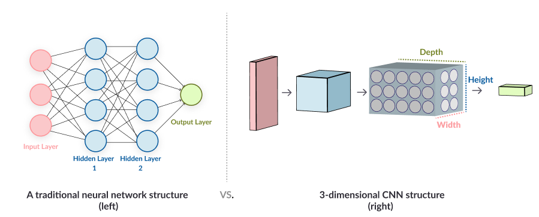
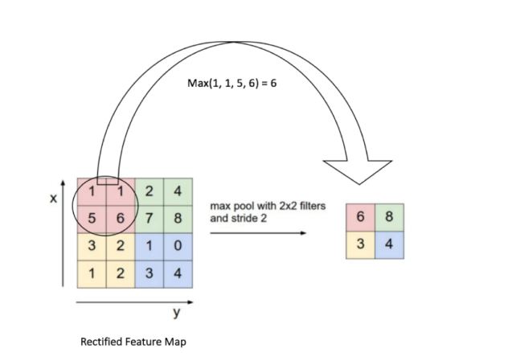
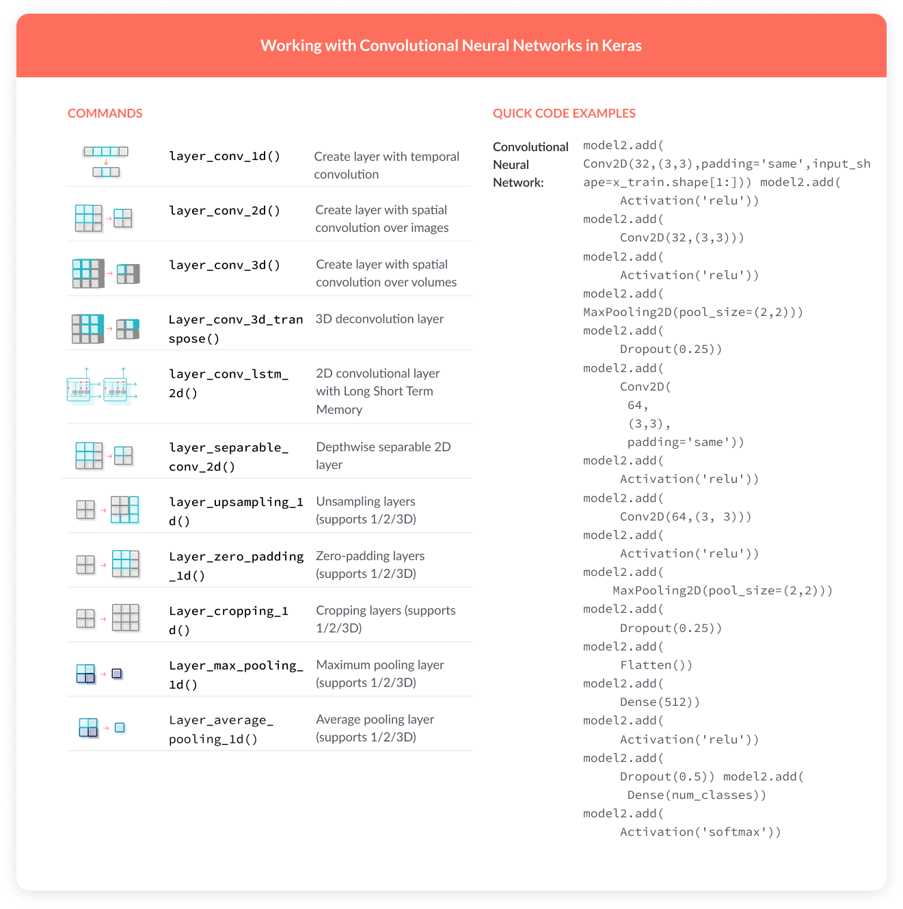
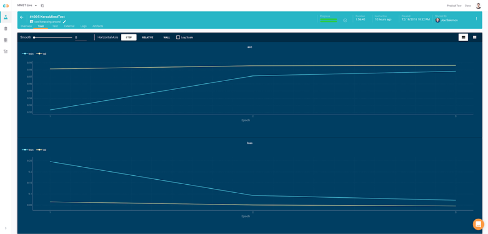
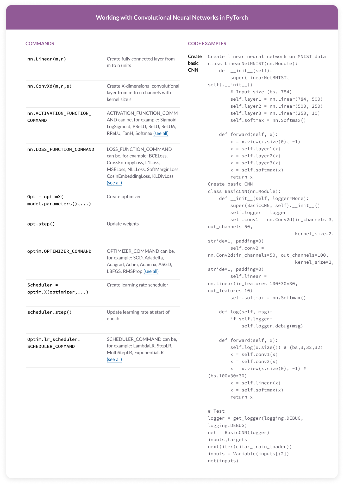

# Convolutional Neural Network:

## @ MissingLink.ai

> A lot has been written about convolutional neural network theory—how do you build one in practice? Get a cheat sheet and quick tutorials Keras and PyTorch.

A Brief Intro to Convolutional Neural Networks
----------------------------------------------

Convolutional Neural Networks (CNN) have proven very good at processing data that is closely knitted together. A CNN uses a three-dimensional structure, with three specialized neural networks analyzing the red, green and blue layers of a color image. CNN scans an image one area at a time, identifies and extracts important features, and uses them to classify the image.

CNNs are primarily used for computer vision, powering tasks like image classification, face recognition, identifying and classifying everyday objects, and image processing in robots and autonomous vehicles. They are also used for video analysis and classification, semantic parsing, automatic caption generation, search query retrieval, sentence classification, and more.

While the typical CNN uses 2-dimensional or 3-dimensional neural layers to analyze images with 2 or 3 color channels, CNNs with 1-dimensional layers are also very useful. A 1D CNN can derive important features from short segments of an overall dataset when the position of each segment is not so important. For example, sensor data, audio signals, and natural language processing.

### CNN Architecture

A plain vanilla neural network, in which all neurons in one layer communicate with all the neurons in the next layer (this is called “fully connected”), is inefficient when it comes to analyzing large images and video. For an average size image with hundreds of pixels and three color channels (red, green, blue), the number of parameters using a traditional neural network will be in the millions, which can lead to overfitting.

To limit the number of parameters and focus the neural network on important parts of the image, a CNN uses a three-dimensional structure in which each set of neurons analyzes a small region or “feature” of the image. Instead of having all neurons pass their decisions to the next neural layer, each group of neurons specializes on identifying one part of the image, for example, the nose, left ear, mouth or hair. The final output is a vector of probability scores, representing how likely each of the features is to be part of a class.



### How CNNs Works

A CNN operates in three stages. The first is a _convolution_, in which the image is “scanned” a few pixels at a time, and a _feature map_ is created with probabilities that each feature belongs to the required class (in a simple classification example). The second stage is _pooling_ (also called downsampling), which reduces the dimensionality of each feature while maintaining its most important information. The pooling stage creates a “summary” of the most important features in the image.


Most CNNs use “max pooling”, in which the highest value is taken from each pixel area scanned by the CNN, as illustrated below.



**Image Source: [Stanford](https://cs231n.github.io/convolutional-networks/)**

A CNN can perform several rounds of convolution then pooling. For example, in the first round, an image can be broken down into objects, such as a boat, a person, a plane of grass. In the second round, the CNN can identify features within each object, for example, a face, torso, hands, legs. In a third round, the CNN could go deeper and analyze features within the face, etc.

Finally, when the features are at the right level of granularity, the CNN enters the third stage, which is a fully-connected neural network that analyzes the final probabilities, and decides which class the image belongs to. The final step can also be used for other tasks, such as generating text—a common use of convolutional networks is to automatically generate captions for images.

We deliberately kept the theoretical part short, to get to the punch of how to build a CNN yourself.

* _To understand convolutional neural networks in more detail, see this in-depth guide from [Andrej Karpathy](https://cs231n.github.io/convolutional-networks/)_

Enough talk—let’s see how it’s done.

Your First Convolutional Neural Network in Keras
------------------------------------------------

Keras is a high-level deep learning framework which runs on top of TensorFlow, Microsoft Cognitive Toolkit or Theano. It lets you build standard neural network structures with only a few lines of code. To customize and create your own deep learning algorithms, you’ll need to work directly with TensorFlow or another lower-level deep learning framework.

CNN in Keras is based on a sequential model—you define parameters, create a model object and add convolutional layers to it.  

### Keras CNN Commands Cheat Sheet



Training a CNN on the MNIST Dataset in Keras—a Brief Tutorial
-------------------------------------------------------------

This tutorial will show you how to load the MNIST dataset and, a benchmark deep learning dataset, containing 70,000 handwritten numbers from 0-9, and building a convolutional neural network to classify the handwritten digits. Our discussion is based on the excellent tutorial by [Elijaz Allibhai](https://towardsdatascience.com/building-a-convolutional-neural-network-cnn-in-keras-329fbbadc5f5).

**Follow these steps to train CNN on MNIST and generate predictions:**

1\. Load the MNIST dataset and split into train and test sets, with X\_train and X\_test containing the training and testing images, and `y_train` and `y_test` containing the “ground truth” of the digits represented in the images. In the MNIST data set 60,000 images are used for training and 10,000 for testing/validation (learn more about [neural network bias and variance in our neural network guide](https://missinglink.ai/guides/neural-network-concepts/neural-network-bias-bias-neuron-overfitting-underfitting/)).

```python
from keras.datasets import mnist  
(X_train, y_train), (X_test, y_test) = mnist.load_data()
```


2\. View one of the images using the `plt.imshow` command, and check its size using the `.shape` function, to understand what the dataset looks like. Try this on several images. As you will see, all the MNIST images are uniformly 28 x 28 pixels in size and contain handwritten digits.

```python
import matplotlib.pyplot as plt 
plt.imshow(X_train[0]) 
X_train[0].shape
```


3\. Reshape the two sets of images, `X_train` and `X_test`, to the shape expected by the CNN model. The Keras `reshape` function takes four arguments: number of training images, pixel size, and image depth—use 1 to indicate a grayscale image.

```python
X_train = X_train.reshape(60000,28,28,1) 
X_test = X_test.reshape(10000,28,28,1)
```


4\. Next, you’ll need to ‘one-hot-encode’ the target variable—create a column for each classification category, with each column containing binary values indicating if the current image belongs to that category or not. Because we are classifying digits, there will be 10 columns for digits 0-9, and according to the classification decision, one of the columns will have a 1 (e.g. the column for the digit 3) and the rest will be 0.

**Note:** If you train with normal class numbers, this will introduce a bias. The model will consider higher value digits (e.g., 9) to be greater than lower value digits (e.g. 1). One-hot-encoding causes the model to treat all digits as equivalent.

```python
from keras.utils import to_categorical 
y_train = to_categorical(y_train) 
y_test = to_categorical(y_test) 
y_train[0]
```


5\. Create a model, using the `Sequential` model type, which lets you build a model by adding on one layer at a time.

```python
from keras.models import Sequential 
from keras.layers import Dense, Conv2D, Flatten 
model = Sequential()
```


6\. Add model layers: the first two layers are Conv2D—2-dimensional convolutional layers These are convolution layers that deal with the input images, which are seen as 2-dimensional matrices. The `Conv2D` function takes four parameters:

* Number of neural nodes in each layer. We will use 64 for the first convolutional layer and 32 for the second.
* `kernel_size` defines the filter size—this is the area in square pixels the model will use to “scan” the image. Kernel size of 3 means the model looks at a square of 3×3 pixels at a time.
* activation is the type of activation function (click to learn more in our [neural network guide](https://missinglink.ai/guides/neural-network-concepts/7-types-neural-network-activation-functions-right/)) we use after each convolutional layer. For CNN the typical activation function used is ReLu.
* `input_shape` is the pixel size of the images and the image depth, again setting 1 for grayscale.

```python
model.add(Conv2D(64, kernel_size=3, activation=’relu’, input_shape=(28,28,1))) 
model.add(Conv2D(32, kernel_size=3, activation=’relu’))
```


**Note:** Each of the convolution layers reduces the depth, width and height of each feature, this is equivalent to the pooling/downsampling stage in the CNN model. The formula for calculating the output size for any given conv layer is:  
O = ((W-K+2P)/S)+1 where O is the output height/length, W is the input height/length, K is the filter size, P is the padding, and S is the stride.

7\. Add a ‘Flatten’ layer, which takes the output of the two convolution layers and turns it into a format that can be used by the final, densely connected neural layer.

`model.add(Flatten())`

8\. Add the final layer of type ‘Dense’, a densely-connected neural layer which will generate the final prediction. The Dense function takes two arguments:

* Number of output nodes—10 in our case because we need to generate predictions for digits between 0-9.
* Type of activation function for the output layer. We use `softmax` which is the typical activation function used for neural output layers. Softmax takes the Dense layer output and converts it to meaningful probabilities for each of the digits, which sum up to 1. It then makes a prediction based on the digit that has the highest probability.

`model.add(Dense(10, activation=’softmax’))`

9\. Compile the model. The `compile` function takes three parameters:

* `optimizer` controls the learning rate, which defines how fast optimal weights for the model are calculated (learn more about [hyperparameters](https://missinglink.ai/guides/neural-network-concepts/hyperparameters-optimization-methods-and-real-world-model-management/) in our neural network guide). We will use the ‘adam’ learning rate optimizer.
* `loss` defines the loss function, which measures how far the model’s prediction is from the ground truth, the correct digits for the images (learn more about loss functions and the [backpropagation](https://missinglink.ai/guides/neural-network-concepts/backpropagation-neural-networks-process-examples-code-minus-math/) process). We will use ‘categorical\_crossentropy’, a loss function suitable for classification problems.
* `metrics` defines how we evaluate model success. We’ll use the ‘accuracy’ metric to calculate an accuracy score on the testing/validation set of images.

`model.compile(optimizer='adam', loss='categorical_crossentropy', metrics=['accuracy'])`

10\. Training the model, using the `fit` function which takes three parameters:

* training data (train\_X)
* target data (train\_y)
* validation data
* number of epochs—number of times the backpropagation process will be run on the training images—we will set this to 3.

`model.fit(X_train, y_train, validation_data=(X_test, y_test), epochs=3)`

11\. The model trains, the output should look like this:




As you can see above, after three epochs, accuracy on the validation set is up to 97.57%. The CNN works well.

Now that you see the model is working, you can generate actual predictions using the `predict` function. The function returns an array of probabilities for each of the 10 possible results (digits 0-9), with the sum of probabilities for each image equal to 1. You can input new, unknown data to the predict function to get a prediction for this data. For now, let’s run a prediction for the first four images in the test set:

`model.predict(X_test[:4])`

The output will show probabilities for digits 0-9, for each of the 4 images. The model predicts 7, 2, 1 and 0 for the first four images.

13\. Compare this with actual results for the first 4 images in the test set:

`y_test[:4]`

The output shows that the ground truth for the .first four images is also 7, 2,1 and 0—the model made an accurate prediction.  

Your First Convolutional Neural Network in PyTorch
--------------------------------------------------

PyTorch is a middle ground between Keras and Tensorflow—it offers some high-level commands which let you easily construct basic neural network structures. At the same time, it lets you work directly with tensors and perform advanced customization of neural network architecture and hyperparameters.

To create a CNN model in PyTorch, you use the `nn.Module` class which contains a complete neural network toolkit, including convolutional, pooling and fully connected layers for your CNN model. PyTorch lets you define parameters at every stage—dataset loading, CNN layer construction, training, forward pass, backpropagation, and model testing.

PyTorch CNN Commands Cheat Sheet
--------------------------------



Training CNN on MNIST Dataset in PyTorch
----------------------------------------

This brief tutorial shows how to load the MNIST dataset into PyTorch, train and run a CNN model on it. As mentioned above, MNIST is a standard deep learning dataset containing 70,000 handwritten digits from 0-9. Our discussion is based on the great tutorial by [Andy Thomas](http://adventuresinmachinelearning.com/convolutional-neural-networks-tutorial-in-pytorch/).

**Follow these steps to train CNN on MNIST and generate predictions:**

1\. Set hyperparameters—these are safe to start with.

```python
num\_epochs = 5
num\_classes = 10
batch\_size = 100
learning\_rate = 0.001DATA\_PATH = 'C:\\\\...\\PycharmProjects\\MNISTData'MODEL\_STORE\_PATH = 'C:\\\\...\\PycharmProjects\\pytorch\_models\\\\'
```

2\. Specify local drive folders to store the MNIST dataset, and a location for the trained data.

`MODEL\_STORE\_PATH = 'C:\\\\...\\PycharmProjects\\pytorch\_models\\\\'`

3\. The MNIST dataset comes built into PyTorch, accessible via `torchvision.datasets.MNIST`. Transform the dataset using the `transforms.Compose()` function, as follows:

* Convert the input data set to a PyTorch tensor.
* Normalize the data, supplying the mean (0.1307) and standard deviation (0.3081) of the MNIST dataset. You need to do this for every channel in the dataset, but because MNIST is grayscale, there is only one channel and one mean/STD pair.

`trans = transforms.Compose(\[transforms.ToTensor(), transforms.Normalize((0.1307,), (0.3081,))\])`

4\. Create the `train_dataset` and `test_dataset` objects, providing the following arguments:

* `root`—specifies the folder where the train.pt and test.pt data files exist
* `train`—specifies whether to use the train.pt or test.pt data file
* `transform`—passes the transform object, created earlier
* `download`—specifies that the MNIST data should be downloaded from source if needed

```python
train\_dataset = torchvision.datasets.MNIST(root=DATA\_PATH, train=True, transform=trans, download=True)
test\_dataset = torchvision.datasets.MNIST(root=DATA\_PATH, train=False, transform=trans)
```


5\. Load the train and test datasets into the data loader. A data loader can be used as an iterator – to extract the data, just use a standard Python iterator such as `enumerate`. The `DataLoader` function takes three arguments:

* The data set you wish to load
* The batch size
* Whether you wish to randomly shuffle the data

```python
train\_loader = DataLoader(dataset=train\_dataset, batch\_size=batch\_size, shuffle=True)
test\_loader = DataLoader(dataset=test\_dataset, batch\_size=batch\_size, shuffle=False)
```


6\. Create the CNN model by initializing the `nn.Module` class. This is a PyTorch class which has everything you need to build a neural network. It also provides recursive operations, ways of parallelizing work and moving it to a GPU or back to a CPU, and more. We’ll create the following neural layers:

* `layer1`—using the `nn.Sequential` object, we create a compound layer that includes a 2D convolutional layer, a ReLu activation function and a 2D MaxPool layer.
  * The Conv2d method lets you define, in this order: number of input channels (1 because MNIST images are grayscale), number of output channels, the size of the convolutional filter (you can supply a tuple for different shapes), stride and padding.
  * Stride and padding for the convolutional layer are defined using this equation: Wout=(Win–F+2P)S+1 where Wout=width of output, Win = width of input, F=filter, S=stride, P=padding. The same formula can be used for height, since the images are symmetric. Because we want the output size to be the same as the input (2), we set stride to 1 and padding to 2 → the output width and height = 2.
  * For the pooling layer, we set stride to 2 and padding to zero, to down-sample and reduce images by a factor of 2.
  * Thus, the output from `layer1` will be 32 channels of 14 x 14 pixel images.
* `layer2`—like 1, except input channels are 32 because it received the output of the first layer, and output 64 channels.
* `drop_out` layer to avoid over-fitting in the model.
* `fc1` and `fc2`—Two fully connected layers, created using the `nn.Linear` method. The first with 7 x 7 x 64 nodes, and the second with 1000 nodes. The second argument of `nn.Linear` specifies the number of nodes in the next layer.

```python
class ConvNet(nn.Module):
def \_\_init\_\_(self):
super(ConvNet, self).\_\_init\_\_()
self.layer1 = nn.Sequential(
nn.Conv2d(1, 32, kernel\_size=5, stride=1, padding=2),
nn.ReLU(),
nn.MaxPool2d(kernel\_size=2, stride=2))
self.layer2 = nn.Sequential(
nn.Conv2d(32, 64, kernel\_size=5, stride=1, padding=2),
nn.ReLU(),
nn.MaxPool2d(kernel\_size=2, stride=2))
self.drop\_out = nn.Dropout()
self.fc1 = nn.Linear(7 \* 7 \* 64, 1000)
self.fc2 = nn.Linear(1000, 10)
```


7\. Define the forward pass. To customize forward pass functionality, call this function “forward”, to override the base forward function in `nn.Module`. The second argument x is one batch of data, which is fed into the first neural layer (`layer1`), then to the next layer, and so on. After `layer2`, we reshape the data, flattening it from 7 x 7 x 64 into 3164 x 1.

```python
def forward(self, x):
out = self.layer1(x)
out = self.layer2(out)
out = out.reshape(out.size(0), -1)
out = self.drop\_out(out)
out = self.fc1(out)
out = self.fc2(out)
return out
```


8\. Define training parameters by creating a `ConvNet` object and defining:

* `criterion`—the loss function. We use the PyTorch `CrossEntropyLoss` function which combines a SoftMax and cross-entropy loss function.
* `optimizer`—we use the Adam optimizer, passing all the parameters from the CNN model we defined earlier, and a learning rate.

model = ConvNet()
criterion = nn.CrossEntropyLoss()
optimizer = torch.optim.Adam(model.parameters(), lr=learning\_rate)

9\. Train the model, by running two loops:

* Loop over the number of epochs.
* Within this loop, iterate over `train_loader` using `enumerate`, and do the following:
  * Perform a forward pass, by passing a batch of normalized MNIST images from `train_loader` to the `model` object you defined earlier. There is no need to explicitly run the forward function, PyTorch does this automatically when it executes a model.
  * Pass the `outputs` true image `labels` to the loss function.
  * Append the loss to a list, which you can use later to plot training progress.
  * In preparation for backpropagation, set gradients to zero by calling `zero_grad()` on the optimizer.
  * Perform backpropagation using the `backward()` method of the loss object. Gradients are calculated.
  * Call `optimizer.step()` to perform Adam optimizer training.

```python
total\_step = len(train\_loader)
loss\_list = \[\]
acc\_list = \[\]for epoch in range(num\_epochs):for i, (images, labels) in enumerate(train\_loader):outputs = model(images)loss = criterion(outputs, labels)loss\_list.append(loss.item())optimizer.zero\_grad()loss.backward()optimizer.step()
```


10\. Track accuracy (within the same loop) by:

* Running the `torch.max()` function, which returns the index of the maximum value in a tensor.
* In the first argument of the `max` function, pass a tensor of outputs from the model, which should be of size (batch\_size, 10). For each sample in the batch, this will return the maximum value over the 10 output nodes, each representing one of the digits 0-9. For example, output 2 corresponds to digit “2”. The node with the highest output value will be predicted by the model.
* In the second argument of the `max()` function, pass 1. This instructs the max function to examine the output node axis (axis=0 corresponds to the batch\_size dimension).
* `max()` returns a list of prediction integers from the model
* Compare predictions with the true labels (`predicted == labels`) and sum them to get the number of correct predictions. Divide by the `batch_size` to obtain the accuracy.
* Print progress after every 100 iterations.

`total = labels.size(0)
\_, predicted = torch.max(outputs.data, 1)
correct = (predicted == labels).sum().item()
acc\_list.append(correct / total)if (i + 1) % 100 == 0:print('Epoch \[{}/{}\], Step \[{}/{}\], Loss: {:.4f}, Accuracy: {:.2f}%'.format(epoch + 1, num\_epochs, i + 1, total\_step, loss.item(),(correct / total) \* 100))# output will look like this:# Epoch \[1/6\], Step \[100/600\], Loss: 0.2183, Accuracy: 95.00%`

11\. To test the model, do the following:

* Run `model.eval()`—this runs the model while disabling drop-out or batch normalization layers.
* `torch.no_grad()` disables autograd functionality in the model, this is PyTorch’s mechanism for performing backpropagation and calculating gradients, which is not needed in model testing.
* The remaining code is the same as in the accuracy calculation above, except you are iterating through `test_loader` and not `train_loader`.
* Output the prediction to the console, save model results using `torch.save()`. This enables graphing the results using a plotting library.

```python
model.eval()
with torch.no\_grad():
correct = 0
total = 0
for images, labels in test\_loader:
outputs = model(images)
\_, predicted = torch.max(outputs.data, 1)
total += labels.size(0)
correct += (predicted == labels).sum().item()print('Test Accuracy of the model on the 10000 test images: {} %'.format((correct / total) \* 100))torch.save(model.state\_dict(), MODEL\_STORE\_PATH + 'conv\_net\_model.ckpt')
```


Convolutional Neural Networks in the Real World
-----------------------------------------------

In this article, we explained the basics of Convolutional Neural Networks and showed how to create them in two popular deep learning frameworks, Keras and PyTorch. When you start working on CNN projects, processing and generating predictions for real images, audio and video.

*  
  
  ### Tracking experiments
  
  Tracking experiment progress, source code, and hyperparameters across multiple CNN experiments. Convolutional networks can have many structural variations and hyperparameter tweaks, and testing each of these on your data will require running an experiment and tracking its results.

*  
  
  ### Running experiments across multiple machines
  
  CNNs are very computationally intensive, and real projects will likely require running experiments on multiple machines or GPUs. Provisioning these machines, configuring them and distributing the work among them can become a burden.

*  
  
  ### Manage training data
  
  CNN projects commonly involve rich media such as images or video, and training sets can weight anywhere from Gigabytes to Petabytes. Copying data to training machines and replacing it for different experiments can be time-consuming, and even infeasible in extreme cases.