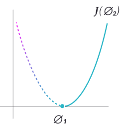
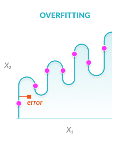
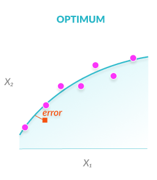
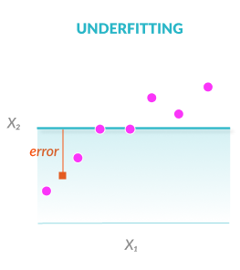

# Hyperparameters: Optimization Methods and Real World Model Management - MissingLink.ai

> Learn how hyperparameters affect accuracy of neural networks, how to optimize them manually vs. automatically, and how to manage large-scale optimization.

What is the Difference Between a Model Parameter and a Hyperparameter?
----------------------------------------------------------------------

In neural networks, parameters are used to train the model and make predictions. There are two types of parameters:

*  
  
  **Model parameters** are internal to the neural network – for example, neuron weights. They are estimated or learned automatically from training samples. These parameters are also used to make predictions in a production model.

*  
  
  **Hyperparameters** are external parameters set by the operator of the neural network – for example, selecting which [activation function](https://missinglink.ai/guides/neural-network-concepts/7-types-neural-network-activation-functions-right/) to use or the batch size used in training. Hyperparameters have a huge impact on the accuracy of a neural network, there may be different optimal values for different values, and it is non-trivial to discover those values.

The simplest way to select hyperparameters for a neural network model is “manual search” – in other words, trial and error. New methods are evolving which use algorithms and optimization methods to discover the best hyperparameters. To learn more about these methods see [Hyperparameter Tuning](#methods) below.

List of Common Hyperparameters
------------------------------

This list assumes a basic knowledge of neural network concepts. For a refresh, see our in-depth [neural network guide](https://missinglink.ai/guides/neural-network-concepts/neural-network-bias-bias-neuron-overfitting-underfitting/).

### Hyperparameters related to neural network structure

**1\. Number of hidden layers** – adding more hidden layers of neurons generally improves accuracy, to a certain limit which can differ depending on the problem.

**2\. Dropout** – what percentage of neurons should be randomly “killed” during each epoch to prevent overfitting.

**3\. Neural network activation function** – which function should be used to process the inputs flowing into each neuron. The activation function can impact the network’s ability to converge and learn for different ranges of input values, and also its training speed.

**4\. Weights initialization** – it is necessary to set initial weights for the first forward pass. Two basic options are to set weights to zero or to randomize them. However, this can result in a vanishing or exploding gradient, which will make it difficult to train the model. To mitigate this problem, you can use a heuristic (a formula tied to the number of neuron layers) to determine the weights. A common heuristic used for the Tanh activation is called Xavier initialization.

### Hyperparameters related to training algorithm

**5\. Neural network learning rate** – how fast the backpropagation algorithm performs gradient descent. A lower learning rate makes the network train faster but might result in missing the minimum of the loss function.

 

**6\. Deep learning epoch, iterations and batch size** – these parameters determine the rate at which samples are fed to the model for training. An epoch is a group of samples which are passed through the model together (forward pass) and then run through [backpropagation](https://missinglink.ai/guides/neural-network-concepts/backpropagation-neural-networks-process-examples-code-minus-math/) (backward pass) to determine their optimal weights. If the epoch cannot be run all together due the size of the sample or complexity of the network, it is split into batches, and the epoch is run in two or more iterations. The number of epochs and batches per epoch can significantly affect model fit, as shown below.

  

**7\. Optimizer algorithm and neural network momentum** – when a neural network trains, it uses an algorithm to determine the optimal weights for the model, called an optimizer. The basic option is Stochastic Gradient Descent, but there are other options. Another common algorithm is Momentum, which works by waiting after a weight is updated, and updating it a second time using a delta amount. This speeds up training gradually, with a reduced risk of oscillation. Other algorithms are Nesterov Accelerated Gradient, AdaDelta and Adam.

4 Methods of Hyperparameter Tuning in a Deep Neural Network
-----------------------------------------------------------

**Tuning or optimizing hyperparameters** involves finding the values of each hyperparameter which will help the model provide the most accurate predictions.

Optimization Metric and Validation
----------------------------------

Hyperparameter tuning is always performed against an **optimization metric** or score. This is the metric you are trying to optimize when you try different hyperparameter values. Typically, the optimization metric is accuracy. However, if you blindly optimize for accuracy and ignore overfitting or underfitting, you’ll get a highly accurate model (when applied to the training set) but which does not perform well with unknown samples. **Validation** helps ensure you are not optimizing for accuracy at the expense of model fit. To perform validation, the training samples are split into at least two parts: a training set and a validation set. The model is trained on the samples and then run on the validation set for testing. This allows you to gauge if the model is underfitting or overfitting. If the number of samples is small, you can use **cross validation** – this involves dividing the training set into multiple groups, for example 10 groups. You can then train the model on each of the 10 groups, and validate it against the other 9. By doing this for all 10 combinations, you can simulate a much larger training and validation set.

*  
  
  ### 1\. Manual Hyperparameter Tuning
  
  Traditionally, hyperparameters were tuned manually by trial and error. This is still commonly done, and experienced operators can “guess” parameter values that will achieve very high accuracy for deep learning models. However, there is a constant search for better, faster and more automatic methods to optimize hyperparameters. **Pros:** Very simple and effective with skilled operators **Cons:** Not scientific, unknown if you have fully optimized hyperparameters

* 
  
  ### 2\. Grid Search
  
  Grid search is slightly more sophisticated than manual tuning. It involves systematically testing multiple values of each hyperparameter, by automatically retraining the model for each value of the parameter. For example, you can perform a grid search for the optimal batch size by automatically training the model for batch sizes between 10-100 samples, in steps of 20. The model will run 5 times and the batch size selected will be the one which yields highest accuracy. **Pros:** Maps out the problem space and provides more opportunity for optimization **Cons:** Can be slow to run for large numbers of hyperparameter values

*  
  
  ### 3\. Random Search
  
  According to a [2012 research study](http://www.jmlr.org/papers/volume13/bergstra12a/bergstra12a.pdf) by James Bergstra and Yoshua Bengio, testing randomized values of hyperparameters is actually more effective than manual search or grid search. In other words, instead of testing systematically to cover “promising areas” of the problem space, it is preferable to test random values drawn from the entire problem space. **Pros:** According to the study, provides higher accuracy with less training cycles, for problems with high dimensionality **Cons:** Results are unintuitive, difficult to understand “why” hyperparameter values were chosen

*  
  
  ### 4\. Bayesian Optimization
  
  Bayesian optimization (described by [Shahriari, et al](https://drive.google.com/viewerng/viewer?url=https://www.cs.ox.ac.uk/people/nando.defreitas/publications/BayesOptLoop.pdf)) is a technique which tries to approximate the trained model with different possible hyperparameter values. To simplify, bayesian optimization trains the model with different hyperparameter values, and observes the function generated for the model by each set of parameter values. It does this over and over again, each time selecting hyperparameter values that are slightly different and can help plot the next relevant segment of the problem space. Similar to sampling methods in statistics, the algorithm ends up with a list of possible hyperparameter value sets and model functions, from which it predicts the optimal function across the entire problem set. **Pros:** The original study and practical experience from the industry shows that bayesian optimization results in significantly higher accuracy compared to random search. **Cons:** Like random search, results are not intuitive and difficult to improve on, even by trained operators

Hyperparameter Optimization in the Real World
---------------------------------------------

In a real neural network project, you will have three practical options:

1. Performing manual optimization
2. Leveraging hyperparameter optimization techniques in the deep learning framework of your choice. The framework will report on hyperparameter values discovered, their accuracy and validation scores
3. Using third party hyperparameter optimization tools

**If you use Keras**, the following libraries provide different options for hyperparameter optimization: [Hyperopt](https://github.com/maxpumperla/hyperas), [Kopt](https://github.com/Avsecz/kopt) and [Talos](https://github.com/autonomio/talos)

**If you use Tensorflow,** you can leverage open source libraries such as [GPflowOpt](https://github.com/GPflow/GPflowOpt) which provides bayesian optimization, and commercial solutions like [Google’s Cloud Machine Learning Engine](https://cloud.google.com/ml-engine/docs/tensorflow/using-hyperparameter-tuning).

**For third party optimization tools**, see this post by [Mikko Kotila](https://medium.com/@mikkokotila/a-comprehensive-list-of-hyperparameter-optimization-tuning-solutions-88e067f19d9).

Managing Models, Experiments and Data for Hyperparameter Optimization
---------------------------------------------------------------------

Whether you tune hyperparameters manually or using an automated tool, you will need to run experiments repeatedly to test the results, constantly shifting data between training and validation sets. 