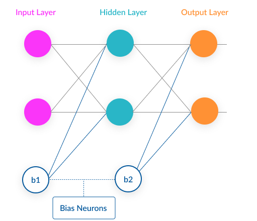
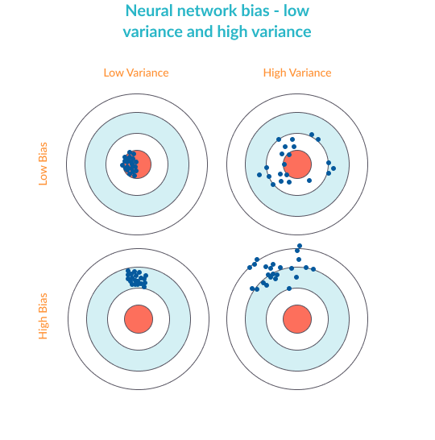
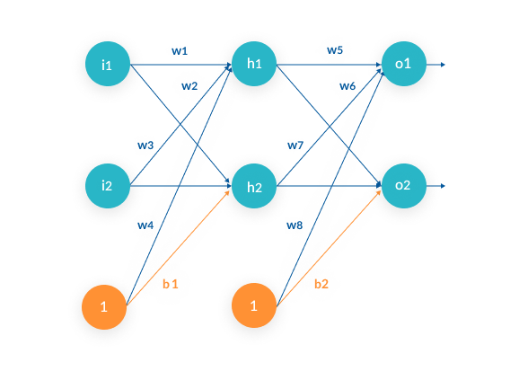
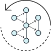
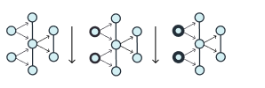
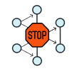
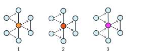
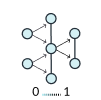
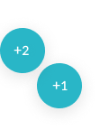
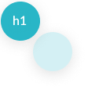

# Neural Network Bias: Bias Neuron, Overfitting and Underfitting

### @MissingLink.ai

> Bias can mean a bias neuron in a neuron network or bias as in the bias-variance tradeoff. Learn about both and how to combat overfitting in deep learning.

What Do We Mean by the Word Bias?
---------------------------------

The word bias can have several meanings in neural networks. We’ll explore the two most common meanings: bias as a [bias neuron](https://missinglink.ai/guides/neural-network-concepts/complete-guide-artificial-neural-networks/) and bias as the bias vs. variance statistic.

### Bias Neuron in a Neural Network

A neural network is a mathematical construct that can approximate almost any function, and generate predictions for complex problems.

A neural network is composed of neurons, which are very simple elements that take in a numeric input, apply an [activation function](https://missinglink.ai/guides/neural-network-concepts/7-types-neural-network-activation-functions-right/) to it, and pass it on to the next layer of neurons in the network. Below is a very simple neural network structure.

The [bias neuron](https://missinglink.ai/guides/neural-network-concepts/backpropagation-neural-networks-process-examples-code-minus-math/) is a special neuron added to each layer in the neural network, which simply stores the value of 1. This makes it possible to move or “translate” the activation function left or right on the graph.

Without a bias neuron, each neuron takes the input and multiplies it by a weight, with nothing else added to the equation. So, for example, it is not possible to input a value of 0 and output 2. In many cases, it is necessary to move the entire activation function to the left or right to generate the required output values—this is made possible by the bias.

Although neural networks can work without bias neurons, in reality, they are almost always added, and their weights are estimated as part of the overall model.

To see a more complete example of a neural network and a bias neuron, see Creating a Neural Network Model with Bias Neuron below.

### The Bias-Variance Tradeoff—Overfitting and Underfitting

Bias and variance are two statistical concepts that are important for all types of machine learning, including neural networks.

Basic Concepts: the Training and Validation Error
-------------------------------------------------

Before we introduce bias and variance, let’s start with a few basic concepts:

*  
  
  ### Training Set
  
  A training set is a group of sample inputs you can feed into the neural network in order to train the model. The neural network learns your inputs and finds weights for the neurons that can result in an accurate prediction.

*  
  
  ### Training Error
  
  The error is the difference between the known correct output for the inputs and the actual output of the neural network. During the course of training, the training error is reduced until the model produces an accurate prediction for the training set.

*  
  
  ### Validation Set
  
  A validation set is another group of sample inputs which were not included in training and preferably are different from the samples in the training set. This is a “real life exercise” for the model: Can it generate correct predictions for an unknown set of inputs?

*  
  
  ### Validation Error
  
  The nice thing is that for the validation set, the correct outputs are already known. So it’s easy to compare the known correct prediction for the validation set with the actual model prediction—the difference between them is the validation error.

Practically, when training a neural network model, you will attempt to gather a training set that is as large as possible and resembles the real population as much as possible. You will then break up the training set into at least two groups: one group will be used as the training set and the other as the validation set.

### Definition of Bias vs. Variance

**Bias**—high bias means the model is not “fitting” well on the training set. This means the training error will be large. Low bias means the model is fitting well, and training error will be low.

**Variance**—high variance means that the model is not able to make accurate predictions on the validation set. The validation error will be large. Low variance means the model is successful in breaking out of its training data.

### Overfitting and Underfitting

To take a real-life example, borrowed from the excellent post by [William Koehrsen](https://towardsdatascience.com/overfitting-vs-underfitting-a-conceptual-explanation-d94ee20ca7f9), **overfitting** is like trying to learn the English language by using a very specific training set. For example, reading all the plays by Shakespeare. Someone who learns the language using only Shakespeare, as an example, will learn a very specialized form of English and may not be able to understand other English text.

To understand **underfitting**, consider someone who tries to learn English by listening to Seinfeld episodes, but ignoring most of the sentences and using only those that start with common words like “a”, “the”, “I”, etc. This person would have a very limited understanding even of those sentences themselves, not to mention a poor ability to understand English text in general.

*  
  
  ### Overfitting in Neural Networks
  
  Overfitting happens when the neural network is very good at learning its training set, but cannot generalize beyond the training set (known as the generalization problem).
  
  ###### The symptoms of overfitting are:
  
  * **Low bias  
    **accurate predictions for the training set
  * **High variance**  
    poor ability to generate predictions for the validation set

*  
  
  ### Underfitting in Neural Networks
  
  Underfitting happens when the network is not able to generate accurate predictions on the training set—not to mention the validation set.
  
  ###### The symptoms of underfitting are:
  
  * **High bias  
    **poor predictions for the training set
  * **High variance  
    **poor predictions for the validation set

To learn more about how to combat overfitting (by reducing variance) and underfitting (by reducing bias and variance), see Managing Bias and Variance below.

A Simple Neural Network Model with a Bias Neuron
------------------------------------------------

The image above is a simple neural network that accepts two inputs which can be real values between 0 and 1 (in the example, 0.05 and 0.10), and has three neuron layers: an input layer (neurons i1 and i2), a hidden layer (neurons h1 and h2), and an output layer (neurons o1 and o2).

**How do the neurons work?** Each neuron is a very simple component which does nothing but executes the activation function. There are several commonly-used activation functions; for example, this is the sigmoid function:

f(x) = 1 / 1 + exp(-x)

[**_Go in-depth: Learn more in our guide on Activation Functions_**](https://missinglink.ai/guides/neural-network-concepts/7-types-neural-network-activation-functions-right/)

When the inputs are fed into the neuron, they are multiplied by **weights**. For example, the weight for neuron i1 feeding into h1 is 0.15. So the input of 0.05 will be multiplied by 0.15 giving 0.333, and then fed into the activation function of neuron h1. The weights are learned in an iterative process called [backpropagation](https://missinglink.ai/guides/neural-network-concepts/backpropagation-neural-networks-process-examples-code-minus-math/).

[**_Go in-depth: Learn more in our guide on Backpropagation_**](https://missinglink.ai/guides/neural-network-concepts/backpropagation-neural-networks-process-examples-code-minus-math/)

**Where are the bias neurons?** As explained above, biases in neural networks are extra neurons added to each layer, which store the value of 1. In our example, the [bias neurons](https://missinglink.ai/guides/neural-network-concepts/neural-networks-regression-part-1-overkill-opportunity/) are b1 and b2 at the bottom. They also have weights attached to them (which are learned during backpropagation).

**The forward pass**

Our simple neural network works by:

1\. Taking each of the two inputs

2\. Multiplying by the first-layer weights—w1,2,3,4

3\. Adding the bias value of 1 multiplied by the weight of [bias neuron](https://missinglink.ai/guides/neural-network-concepts/perceptrons-and-multi-layer-perceptrons-the-artificial-neuron-at-the-core-of-deep-learning/) b1

4\. Applying the activation function for neurons h1 and h2

5\. Taking the output of h1 and h2, multiplying by the second layer weights—w5,6,7,8

6\. Adding the bias value of 1 multiplied by the weight of bias neuron b2

7\. The result of the calculation for each of the neurons o1 and o2 is the output or prediction of the neural network.

Managing Bias and Variance in Neural Networks
---------------------------------------------

Now that we understand what bias and variance are and how they affect a neural network (if you skipped it, see our introduction to the Bias-Variance Tradeoff above), let’s see a few practical ways to reduce bias and variance, and thus combat an overfitting or underfitting problem.

Methods to Avoid Overfitting in Neural Networks
-----------------------------------------------

The following are common methods used to improve the generalization of a neural network, so that it provides better predictive performance when applied to the unknown validation samples. The goal is to improve variance.

*  
  
  ### Retraining Neural Networks
  
  Running the same neural network model on the same training set, but each time with different initial weights. The neural network with the lowest performance is likely to generalize the best when applied to the validation set.

*  
  
  ### Multiple Neural Networks
  
  To avoid “quirks” created by a specific neural network model, you can train several neural networks in parallel, with the same structure but each with different initial weights, and average their outputs. This can be especially helpful for small, noisy datasets.

*  
  
  ### Early Stopping
  
  Divide training data into a training set and a validation set and start training the model. Monitor the error on the validation set after each training iteration. Normally, the validation error and training set errors decrease during training, but when the network begins to overfit the data, the error on the validation set begins to rise. Early stopping occurs in one of two cases:
  
  * If the training is unsuccessful, for example in a case where the error rate increases gradually over several iterations.
  * If the training’s improvement is insignificant, for example, the improvement rate is lower than a set threshold.

*  
  
  ### Regularization
  
  Regularization is a slightly more complex technique which involves modifying the error function (usually calculated as the sum of squares on the errors for the individual training or validation samples).
  
  Without getting into the math, the trick is to add a term to the error function, which is intended to decrease the weights and biases, smoothing outputs and making the network less likely to overfit.

*  
  
  ### Tuning Performance Ratio
  
  The regularization term includes a performance ratio γ—this is a parameter that defines by how much the network will be smoothed out.
  
  * You can manually set a performance ratio—if you set it to zero, the network won’t be regularized at all, and if you set it to 1 it will not fit the training data at all.
  * It is also possible to automatically learn the optimal value of the performance ratio and then apply it to the network to achieve a balance.

Methods to Avoid Underfitting in Neural Networks—Adding Parameters, Reducing Regularization Parameter
-----------------------------------------------------------------------------------------------------

What happens when the neural network is “not working”—not managing to predict even its training results? This is known as underfitting and reflects a **low bias** and **low variance** of the model. The following are common methods for improving fit—the goal is to increase bias and variance of the model.

*  
  
  ### Adding neuron layers or input parameters
  
  For complex problems, adding neuron layers can help generate more complex predictions and improve the fit of the model. Another option, if relevant for your problem, is to increase the number of input parameters flowing into the model (for example, if you are processing an image, input all the pixels from a higher resolution image).

*  
  
  ### Adding more training samples, or improving their quality
  
  The more training samples you provide, and the better they represent the variance of parameters in the population at large, the better the network will learn.

*  
  
  ### Dropout
  
  Another way to improve model fit is to randomly “kill” a certain percentage of the neurons in every training iteration. This can help improve generalization by ensuring that some of the information learned from the training set is randomly removed.

*  
  
  ### Decreasing regularization parameter
  
  If you attempted to improve the model fit with regularization, you may have overdone it! Decrease the performance ratio to improve the fit and reduce bias.

Neural Network Bias in the Real World
-------------------------------------

When training a real neural network model, you will probably use a deep learning framework such as **Keras**, **Tensorflow**, **Caffe** or **Pytorch**. Here is how these frameworks typically handle bias neurons, overfitting and underfitting:

* **Bias neurons** are automatically added to models in most deep learning libraries, and trained automatically.
* **If you experience overfitting**, deep learning frameworks allow you to automatically execute the techniques we discussed—multiple neural networks, early stopping, regularization, and many more.
* **If you experience underfitting**, you can modify [hyperparameters](https://missinglink.ai/guides/neural-network-concepts/hyperparameters-optimization-methods-and-real-world-model-management/) of the model, such as the number of neuron layers (network depth), dropout, regularization, and activation function.

Today’s deep learning frameworks let you train models quickly and efficiently with only a few lines of code and tune their parameters conveniently by configuration.