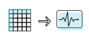

# RNN

> Learn what is an RNN, how it is used to process language, video, and sequential data, variants of the algorithm and building blocks: BPTT and lstm.

A Neural Network Model for Language Processing and Sequential Data
-----------------------------------------------------------------------------------------------------------

A Recurrent Neural Network (RNN) is an algorithm that helps neural networks deal with the complex problem of analyzing input data that is sequential in nature. For example, text written in English, a recording of speech, or a video, has multiple events that occur one after the other, and understanding each of them requires understanding, and remembering, the previous events.

While a traditional neural network accepts a set of inputs and analyzes them all together, an RNN network is able to accept a series of inputs, and each time add additional layers of comprehension on top of the previous inputs. For some background on RNNs, see this post by [Andrej Karpathy](https://karpathy.github.io/2015/05/21/rnn-effectiveness/) on the ‘The Unreasonable Effectiveness of Recurrent Neural Networks’.

What Can RNNs Do?
-----------------

*  
  
  ### Language modeling and text generation
  
  A language model captures the structure of a large body of text, and is able to write additional text in the same tone or style. Models work by predicting the most suitable next character, next word, or next phrase in the generated text.

*  
  
  ### Machine translation
  
  The input is a sequence of words in the source language, and the model attempts to generate matching text in the target language. The input phrase or sentence is fed to the network as a batch, from start to finish, because translation is usually not word-for-word.

*  
  
  ### Speech recognition
  
  The input is an audio recording, parsed into acoustic signals, and the model outputs the most likely syllable or phonetic element matching each part of the recording.

*  
  
  ### Generating image description
  
  The input is an image, and the model identifies important features in the image and generates a brief text that describes the image.

*  
  
  ### Time-series anomaly detection
  
  The input is a sequential data series, such as behavior of a user on a network over a full month. The model predicts which of the data in the series represents an anomaly compared to the normal flow of events.

*  
  
  ### Video tagging
  
  The input is a series of video frames, and the model generates a textual description of what is happening in the video, frame by frame.

RNN Deep Learning—the Basic Structure
-------------------------------------

### The Neuron Loop

The simplest form of RNN (“vanilla” RNN) is similar to a regular neural network, only it contains a loop that allows the model to carry forward results from previous neuron layers.  

The image below “unrolls” how the loop works. The network looks at a series of inputs over time, X0, X1, X2, until Xt. For example, this could be a sequence of words in a sentence. The neural network has one layer of neurons for each input (in our example, one layer for each word).  At each stage in the sequence, each layer of neurons generates two things:

* **An output—H0, H1, H2**—this is the model’s prediction for what should be the next element in the sequence
* **A hidden state—S0, S1, S2**—this is the network’s “short-term memory”. The hidden state is an activation function, which takes as its input both the hidden state of the previous step and the output of the current step. This allows the model to carry over information from previous steps to the current step.

When the network is trained, it not only assigns weights to each neuron’s inputs, like in a traditional neural network but also discovers the parameters of the hidden state function. These parameters define how much of the information from the previous steps should be carried forward to each subsequent step (this may differ between problems).

### Backpropagation Through Time (BPTT)

Regular backpropagation tweaks the weights of the model in several iterations, using training samples. In an RNN, backpropagation needs to take into account that the model is carrying forward information from each neural layer to the next, and fine tune the weights that govern this “short-term memory”.

This is called [Backpropagation](https://missinglink.ai/guides/neural-network-concepts/backpropagation-neural-networks-process-examples-code-minus-math/) Through Time (BPTT). BPTT “unrolls” the network, with each time step connecting to all the neurons in the next time step (the next hidden neural layer). BPTT uses the chain rule to go back from the latest time step to the previous step, and then to the next-previous, each time using gradient descent to discover the best weights for each neuron and for the hidden state function.

### Long Short-Term Memory—the Structure of an LSTM Cell

In the late 1990s, German researchers [Hochreiter and Schmidhuber](http://www.bioinf.jku.at/publications/older/2604.pdf) proposed the concept of [Long Short-Term Memory (LSTM)](https://missinglink.ai/guides/neural-network-concepts/deep-learning-long-short-term-memory-lstm-networks-remember/), which would help an RNN retain information over a longer period of time, not just in between two steps in time. For example, a character’s name, used at the beginning of a paragraph in a novel, can be important for understanding who is speaking or what is being said at the end. An LSTM cell allows the network to pick up such pertinent information and save it, injecting it back into the model when necessary.  While a basic RNN has only a simple activation function, an LSTM cell has four. Three sigmoid activation functions output numbers between 0 and 1, and lead to a pointwise multiplication gate. This gate determines whether information should enter the cell or not—0 means no information enters, and 1 means all the information enters. These three cells are used to save pertinent information for later stages of the learning process. In the [training](https://missinglink.ai/guides/deep-learning-frameworks/tensorflow-distributed-training-introduction-tutorials/) process, the network learns what are the optimal values for the gates, or how much of the information should be retained to help the network make the most accurate prediction.

RNN Extensions and Types
------------------------

**Bidirectional RNNs** A bidirectional RNN assumes that the correct output not only depends on the previous inputs in the time series but also on future inputs. For example, in translation models, it is often necessary to use a word from the end of the source sentence in order to predict a word early in the target sentence. To make this possible, two RNNs are stacked on top of each other, one going from beginning to end and the other from end to beginning, and the output is computed based on hidden states of both networks.  **Deep (Bidirectional) RNNs** A deep RNN uses multiple neuron layers per time step. This is, in essence, a three-dimensional neural network which progresses from left to right, from right to left, and from bottom to top. This architecture provides higher learning capacity, but also requires more training data. ******Long Short-Term Memory Units (LSTMs) RNNs** An LSTM RNN leveraging an LSTM cell, explained above, has the same architecture as a basic RNN (can be since RNN, bidirectional or deep bi-directional), except that all its activation functions are replaced with an LSTM cell.

### Additional RNN extensions and types:

* **Fully recurrent** – a network comprised of layers including neuron-like nodes, where each node is connected to a node in the next layer with a one-way connection.
* **Elman/Jordan networks, or Simple Recurrent Networks (SRN)**:
  * Elman networks are comprised of three layers arranged horizontally as x, y, and z. In addition, a set of “context units” connect to a middle (hidden) layer and are fixed with a weight of one.
  * Jordan networks are similar to Elman networks, but the context units are fed from the output layer instead of the hidden layer.
* **Recursive neural network** – in a recursive network, the same set of weights is applied recursively over a differentiable graph-like structure by traversing the structure in topological order.
* **Bidirectional Associative Memory (BAM)** – a variant of a Hopfield network including two layers, and storing associative data as vectors. Each layer can be used as an input to recall an association and produce an output on the other layer.
* **Hopfield** – an RNN in that includes only symmetric connections. This RNN does not process sequences of patterns and guarantees that it will converge.
* **Hierarchical** – a network in which the neurons are connected in various ways, decomposing hierarchical behavior into useful subprograms.
* **Echo State Network (ESN)** – includes a random hidden layer that is sparsely connected. The only part of the network that can be trained is the weights of the output neurons.
* **Neural Turing machines (NTMs)** – refers to the extension of recurrent neural networks by coupling them to external memory resources.
* **Differentiable Neural Computer (DNC)** – extend Neural Turing machines, using chronology records and fuzzy amounts of each memory address.
* **Recurrent Multi-Layer Perceptron (RMLP)** – comprised of cascaded subnetworks, where each one contains multiple layers of nodes and acts as feed-forward (except for the last layer, which may include feedback connections).
* **Independent RNN (IndRNN)** – addressing the problem of gradient vanishing and exploding in fully-connected RNNs, with INdRNNs, neurons are independent of each other’s history.
* **Neural history compressor** – an unsupervised stack of RNNs, which learns to predict the next input using previous inputs.
* **Second order RNNs** – this network uses higher order weights to allow a direct mapping to a finite state machine.
* **Gated recurrent unit (GRU)** – a gating mechanism in recurrent neural networks introduced in 2014, which includes fewer parameters than LSTM.
* **Continuous-Time Recurrent Neural Network (CTRNN)** – this network models the effects of an incoming spike train using a system of differential equations.
* **Multiple Timescales Recurrent Neural Network (MTRNN)** – this neural-based model uses self-organization to simulate the functional hierarchy of the brain.
* **Neural Network Pushdown Automata (NNPDA)** – similar to NTMs, but instead of tapes, differentiable and trained analog stacks are used.

RNN in the Real World
---------------------

Relational Neural Networks (RNN) are the state of the art algorithm used to perform deep learning on language and sequential data. To create an RNN in a real-world project, you’ll fire up a deep learning framework such as Tensorflow or Keras, select hyperparameters such as network architecture, number of layers and an activation function, and the model will immediately be ready to train.

For example, in [TensorFlow](https://www.tensorflow.org/tutorials/sequences/recurrent), you can choose an optimizer for the weights (simple Stochastic Gradient Descent, AdaOptimizer, MomentumOptimizer, etc), an activation cell (Basic, Gru, LSTM, Multi RNN), and an RNN architecture (static RNN with a uniform length for all input sequences, dynamic RNN with the ability to have inputs of different lengths, and static bidirectional RNN). Today’s deep learning frameworks let you create Recurrent Neural Networks quickly with just a few lines of code, despite their theoretical complexity.