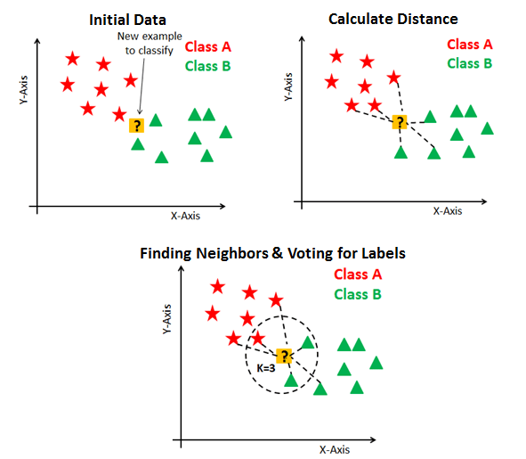

# K nearest Neignbors

- Supervised

- Classification

- Non-Parametric learning ( It doesn't assume anything about the underlying data)

It uses all of the data for training while classifying a new data point or instance.

<u>Algorithm :</u>

It simply calculates the distance of a new data point to all other  training data points. The distance can be of any type e.g Euclidean or Manhattan etc. It then selects the K-nearest data points, where K can be any integer. Finally it assigns the data point to the class to which the majority of the K data points belong.

@kdnuggets.com

- Smaller K is more sensitive to noise, local fluctuations

- Larger K is less sensitive.

#### Pros

1. It is extremely easy to implement
2. As said earlier, it is [lazy learning](https://en.wikipedia.org/wiki/Lazy_learning) algorithm and therefore requires no training prior to making real time predictions. This makes the KNN algorithm much faster than other algorithms that require training e.g SVM,  etc.
3. Since the algorithm requires no training before making predictions, new data can be added seamlessly.
4. There are only two parameters required to implement KNN i.e. the 
   value of K and the distance function (e.g. Euclidean or Manhattan etc.)

#### Cons

1. The KNN algorithm doesn't work well with high dimensional data 
   because with large number of dimensions, it becomes difficult for the 
   algorithm to calculate distance in each dimension.
2. The KNN algorithm has a high prediction cost for large datasets. 
   This is because in large datasets the cost of calculating distance 
   between new point and each existing point becomes higher.
3. Finally, the KNN algorithm doesn't work well with categorical 
   features since it is difficult to find the distance between dimensions 
   with categorical features.

## Implementation

<u>Tools</u> :

- Scikit-Learn
- Numpy
- Pandas
- Matplotlib

<u>Dataset</u> :

- UCI *( Iris )* Dataset

<u>Notebook</u> : [KNN](https://github.com/Mnpr/ML_Implementations/blob/master/KNN.ipynb)

### Resources

- [Develop k-Nearest Neighbors in Python From Scratch](https://machinelearningmastery.com/tutorial-to-implement-k-nearest-neighbors-in-python-from-scratch/)
