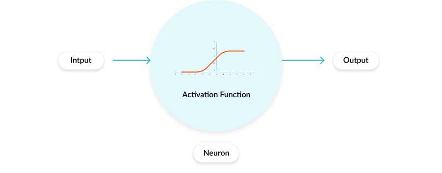

# Neuron

### Biological "Ideal" information processing in the brain

- Capabilities for learning and self-organization

- Generalization Capability, flexibility, adaptation to different environments

- Ability to handle incomplete, contradictiory and noisy data: ( Fault Tollerance )

#### Brain

- Interconnected network of ($10^{10} to 10^{11}$ Neurons )

- Each neuron connected to about $10,000$ other neurons via synapse
  
  - $10^{14} $to $10^{15}$ Synaptic connection

@ [Neuron](en.wikipedia.org/Neuron)

- Dendrites receive input (action potentials) from other neurons via synapses; inputs are propagated along dendrites to cell body.

- ***Spatio-temporal Integration*** of all input emits an action potential which propagates along the axon to synapses connecting to other neurons.
  
  - **Post-Synaptic Potential( h )**
  
  - If h exceeds threshold, the neuron emits an action potential which
    propagates along the axon to synapses connecting to other neurons.
  
  - **Learning**: Modification of synaptic weight corresponding to synaptic activity

# Perceptron

> *Inspired by the information processing of a single neural cell called a neuron*.

**Basic Element:** Neuron( Nerve Cell )

**Basic Neuronal Event:** Generation of Action Potential

**Formal Representation :** Perceptron

@ [ Perceptron ](https://towardsdatascience.com/what-the-hell-is-perceptron-626217814f53)

- **Inputs**: $x_1, ... , x_n$

- **Synaptic weights**: $w_1, ... ,w_n$

- **weighted Input**: $X_i \cdot W_i$

- **Spatio-Temporal Integration of inputs** : $x_1\cdot w_1 + ... + x_n\cdot w_n := h$
  
  - If $h$ exceeds threshold $\theta$, the neuron output y is set to  1. (i.e. $y=1$)
  
  - Else, ( $y = 0$ )

$$
\boxed{y = [h-\Theta] = \Theta\left(\sum_{i=1}^{n} {x_i\cdot w_i} - \theta\right)}
$$

- If other connected Neuron exists : Neuron activation is propagated.

### Threshold as "Bias"

- Additional Weight $W_o = -\theta$ and Constant Input $x_0 = 1$:

$$
\sum_{i=1}^{n} {x_i\cdot w_i} - \theta = \sum_{i=0}^{n} {x_i\cdot w_i}
$$

### Perceptron( Binary ) as linear threshold element

- (Single-layer) perceptron linearly separates the input space into 2 regions.
  
  - Separation boundary : $(m-1)$ dimensional hyperplane satisfying :

$$
\sum_{i=0}^{n} {x_i\cdot w_i} = \theta
$$

- Input patterns $x_1 , ..., x_n$ are points in n-dimensional space.

- Perceptron Partitions input space into two halfspaces along a hyperplane.

$$
\sum_{i=1}^{n} {x_i\cdot w_i} - \theta \gt 0
$$

$$
\sum_{i=1}^{n} {x_i\cdot w_i} - \theta \lt 0
$$

$$
\sum_{i=1}^{n} {x_i\cdot w_i} - \theta = 0
$$

- Represented as Points Above Hyperplane, Below Hyperplane and On Hyperplane respectively.

### Perceptron : Learning

- **Inputs**: $D = {(x^{1},d^{1}), ... , (x^{n},d^{n})}$

- **Goal** :
  
  - Generate perceptron that correctly classifies all patterns( Specifications of synaptic weights, threshold )

##### Algorithm:

- Weight Initialization w

- Iterate ( Modify ) weights $w$ according to deviation  in network output from target.
  
  - For  $x^{\mu}$ ( Input ) Examples, calculate $y^{\mu} = \Theta[w(t)\cdot x^{\mu}]$ Output.
    
    - If (Target) $d^{\mu} = y^{\mu}$ : No modification
    
    - Elif $d^{\mu} \ne y^{\mu}$ : Modification of weights by ( $+/-$) the input sample from $w(t)$ depending on type of error.

**Types of Error**

$$
\boxed{w(t+1) = w(t) + \eta\cdot d^{\mu} - y^{\mu}\cdot x^{\mu}}
$$

@ [Activation](https://stackoverflow.com/questions/10018821/multilayer-perceptron-backpropagation)
