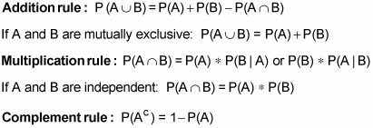
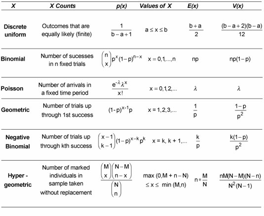
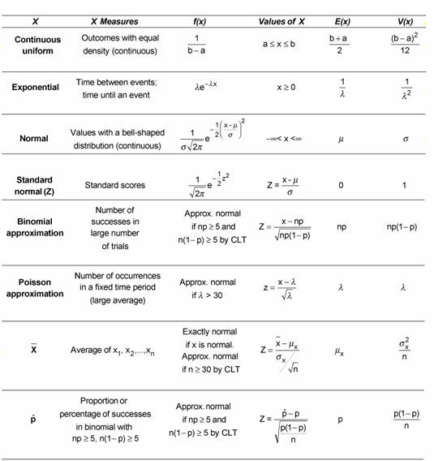
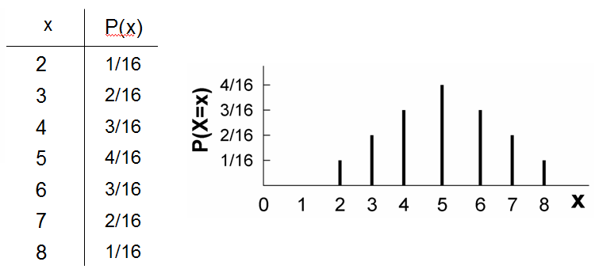
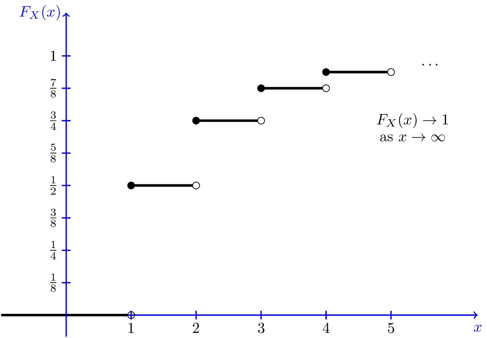

# Probability

## TOC

1. Basic Probability

2. Combinatorics

3. Bayesian Inference

4. Conditional Probability

5. Probability distributions

### 1. Basic Probability

- Probability is the likelihood of an event occurring

- $P(X) = \frac{preferred Outcomes}{Sample Space}$
  
  - The Probability of event X occurring equals the number of preferred outcomes over the number of outcomes in the sample space.

- **If two events are independent :** The probability of them occurring simultaneously equals the product of them occurring on their own.

- Trial – Observing an event occur and recording the outcome.

- Experiment – A collection of one or multiple trials.

- Experimental Probability – The probability we assign an event, based on an experiment we conduct.

- Expected value – the specific outcome we expect to occur when we run an experiment.

**Expected Values**

The expected value can be numerical, Boolean, categorical or other, depending on the type of the event we are interested in. For instance, the expected value of the trial would be the more likely of the two outcomes, whereas the expected value of the experiment will be the number of time we expect to get either heads or tails after the 20 trials.

**Expected value for :**

| Categorical variables. | Numeric variables.                |
| ---------------------- | --------------------------------- |
| $E(X) = n * p$         | $E(X) = \sum_{i=1}^{n} x_i * p_i$ |

**Probalility Rules :**

**Probability Definitons :**

- A and B are mutually exclusive if $P(A\cap B) = 0$

- A and B are independent if $P(A|B) = P(A) or P(B|A) = P(B)$

### 2. Combinatorics

**Permutation**

$$
{_n}P_k = \frac{n!}{(n-k)!}
$$

**Combination**

$$
{_n}C_k = \binom{n}{k} = \frac{n!}{k!(n-k)!}
$$

- $0! = 1$

### 3. Bayesian Inference

**Independent and Dependent Events**

If the likelihood of event A occurring (P(A)) is affected event B occurring, then we say that A and B are dependent events. Alternatively, if it isn’t – the two events are independent.

- We express the probability of event A occurring, given event B has occurred the following way $P(A|B)$.

- Independent : (The outcome of A does not depend on the outcome of B.)
  
  - $P(A|B) = P(A)$

- Dependent : (The outcome of A depends on the outcome of B)
  
  - $P(A|B) \ne P(A)$ 

### 4. Conditional Probability

For any two events A and B, such that the likelihood of B occurring is greater than 0 

$(P(B)\gt0)$, the conditional probability formula states the following.

$$
\boxed{P(A|B) = \frac{P(A\cap B)}{P(B)}}
$$

- The two conditional probabilities possess different meanings even if they have equal values.

**Probability Laws :**

- Law of total probability

- Bayes' Law( Theorem )

**Law of total probability**

The law of total probability dictates that for any set A, which is a union of many mutually exclusive sets B 1 , B 2 , ... , B n , its probability equals the following sum.

$$
\boxed{P(A) = P(A|B_1)\times P(B_1) + ... + P(A|B_n)\times P(B_n)}
$$

 or

$ P(A) = P(A\cap B_1) + ... + P(A\cap B_n)$

Since,

 $P(A\cap B) = P(A|B) \times P(B)$

**Bayes' law**

$$
\boxed{P(A|B) = \frac{P(B|A) \times P(A)}{P(B)}}
$$

### 5. Probability Distributions

The possible values of a variable can take and how frequent they occur.

**Discrete Probability Distribution**

A discrete distribution has either a finite or a countably infinite number of possible values. That means you can enumerate or make a listing of all possible values, such as 1, 2, 3, 4, 5, 6 or 1, 2, 3, . ..

**Continuous Probability Distributions**

A continuous distribution’s probability function takes the form of a continuous curve, and its random variable takes on an uncountably infinite number of possible values. This means the set of possible values is written as an interval, such as negative infinity to positive infinity, zero to infinity, or an interval like [0, 10], which represents all real numbers from 0 to 10, including 0 and 10.

@ [probability cheatsheet](https://www.dummies.com/education/math/probability/probability-for-dummies-cheat-sheet/)

---

#### Random Variables and Their Distributions

***Probability Mass Function P(X = x):***

Gives the probability that a discrete random variable takes on the value of x

[PMF](https://i.stack.imgur.com/7FoIQ.png) Satisfies $p(x)\ge 0), \sum_x p(x) = 1$

***Cumulative Distribution Function:***

Gives the probability that a random variable is less than or equal to x.

$F_X(x) = P(X \le x)$

`

The [CDF](http://probabilitycourse.com/images/chapter3/CDF-geometric_b.png) is an increasing, right-continuous function with

$$
\boxed{F_X(x) \to 0 as x \to-\infty and F_X(x) \to 1 as x \to \infty }
$$

**Discrete Distributions**

- The uniform Dist.

- The Bernouli Dist.

- The Binomial Dist.

- The Poisson Dist.

**Continuous Distributions**

- The Normal Dist.

- The Standart normal Dist.

- The Students' t- Dist.

- The Chi-Squared Dist.

- The Exponential Dist.

- The Logistic Dist.
